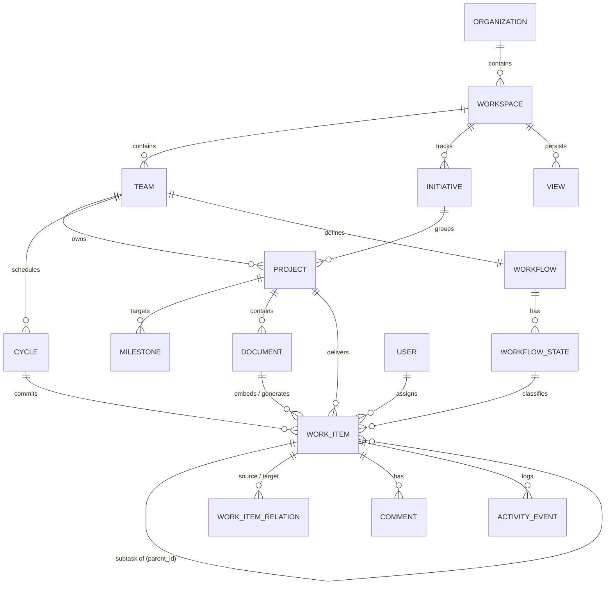

# Orynqo Platform — Product Architecture & Capability Discovery (Pass 01)

**Status:** Proposed Architecture Baseline (Pass 01)  
**Governing Methodology:** `antigravity-enterprise-product-design`  
**Target Quality Bar:** Enterprise-grade, high-density, keyboard-driven productivity platform (Linear/Notion discipline with enterprise scalability)  
**Phase:** 01 — Product Discovery & Architecture Definition  

---

## 1. Product Landscape Analysis

Modern collaborative work and project-management platforms have evolved into distinct categories, each shaped by trade-offs that leave critical gaps for fast-moving cross-functional teams:

| Platform | Primary Archetype | Core Strengths | Critical Weaknesses & Architectural Bottlenecks |
| :--- | :--- | :--- | :--- |
| **Linear** | Opinionated Engineering Issue Tracker | Sub-50ms speed, keyboard-first navigation, sleek minimalist aesthetic, clean cycle and triage workflows. | Rigid opinionation; poor handling of non-engineering workflows; lacks native structured long-form documentation, rich specs, cross-department portfolio roadmapping, and deep enterprise permissioning. |
| **Notion** | Unstructured Block Canvas & Relational Database | Infinite flexibility, nested documents, custom database views (table, board, calendar, gallery). | Lacks opinionated project lifecycle logic, strict cycle/sprint cadences, capacity planning, native git integrations, or keyboard triage queues; can become chaotic without strict schemas. |
| **Jira (Atlassian)** | Enterprise Issue Tracker & Workflow Engine | Deep field customizability, complex RBAC, compliance/audit rigor, portfolio management, marketplace ecosystem. | Catastrophic UX latency, visual noise, card-inside-card sprawl, high cognitive load, endless page reloads, fragmented documentation (Confluence iframe silo), and low user satisfaction. |
| **Asana** | Cross-Functional Work & Portfolio Management | Multi-homed tasks, clean portfolio progress rollups, timeline dependencies, friendly onboarding. | Sluggish for technical power users; weak markdown/spec authoring; shallow sprint/cycle management; card-heavy, low information density. |
| **ClickUp** | "All-in-One" Everything Platform | Vast feature surface (docs, tasks, whiteboards, goals, chat, time tracking, forms). | Severe feature bloat, modal stacking, visual fragmentation, performance degradation, sync lag, and fragile state synchronization. Tries to do everything, masters nothing. |
| **Monday.com** | Visual Spreadsheet & Workflow Board | Highly customizable tabular columns, colorful visual badges, approachable for marketing and HR. | Superficial for complex engineering architectures; lacks native code workflows, strict dependency logic, deep hierarchy, and high-density power-user UX. |

### Core Landscape Insight
The market forces modern technology organizations into a frustrating compromise:
1. **The Fragmented Best-of-Breed Stack**: Notion for RFCs/specs + Linear for engineering issues + Asana for marketing + Spreadsheets for executive capacity. Documents drift from tracking tickets within 48 hours of launch.
2. **The Bloated Monolith**: Jira + Confluence or ClickUp, where teams suffer from visual clutter, poor performance, high latency, and constant context-switching.

**Our Opportunity**: Build a **unified, high-velocity execution engine** that couples **living specifications (documents)** with a **high-density, polymorphic work item graph (issues/tasks/milestones)**, underpinned by instant keyboard navigation and enterprise-grade governance.

---

## 2. Mature-Platform Capability Map

To architect a complete platform without premature scope reduction, we analyze the capability surface across 11 functional domains:

```
┌────────────────────────────────────────────────────────────────────────┐
│                        ORYNQO CAPABILITY DOMAINS                       │
├─────────────────┬─────────────────┬──────────────────┬─────────────────┤
│ 1. WORK GRAPH   │ 2. PROJECTIONS  │ 3. KNOWLEDGE     │ 4. TRIAGE & INBOX│
│ • Orgs/Spaces   │ • High-Dense Grid│ • Living Specs   │ • Unified Inbox │
│ • Teams/Squads  │ • Kanban Board  │ • Doc-to-Work Sync│ • Keyboard Triage│
│ • Initiatives   │ • Gantt/Timeline│ • Inline Blocks  │ • Subscriptions │
│ • Projects      │ • Workload Grid │ • Version History│ • Snooze/Filter │
│ • Polymorphic   │ • Saved Views   │ • Bi-dir Links   │ • Batch Actions │
│   Work Items    │ • Query Engine  │ • RFC Templates  │                 │
├─────────────────┼─────────────────┼──────────────────┼─────────────────┤
│ 5. PLANNING     │ 6. COLLABORATION│ 7. WORKFLOWS     │ 8. EXTENSIBILITY│
│ • Time Cycles   │ • Nested Threads│ • State Machines │ • Bi-dir Git Sync│
│ • Milestones    │ • Presence/Avatars│ • Transition Rules│ • Webhooks API │
│ • Roadmaps      │ • Mentions      │ • SLA/Stale Logic│ • Automations   │
│ • Capacity/Pts  │ • Emojis/Reactions│ • Required Fields│ • Integrations  │
├─────────────────┼─────────────────┼──────────────────┼─────────────────┤
│ 9. IDENTITY/RBAC│ 10. SEARCH/CMD  │ 11. GOVERNANCE                     │
│ • Scoped Roles  │ • Command Pal.  │ • Immutable Audit Logs            │
│ • SAML/SCIM     │ • Fast Omnisearch│ • Data Residency & Legal Hold     │
│ • Guest Sandbox │ • Filter Algebra│ • Encryption & IP Allowlisting     │
└─────────────────┴─────────────────┴────────────────────────────────────┘
```

---

## 3. Table-Stakes Capabilities (Non-Negotiable Baseline)

These features must exist with flawless reliability before power-user or enterprise features can succeed:

1. **Sub-50ms Optimistic Work Item CRUD**: Instant creation, title/property inline editing, deletion with undo (`cmd+z`).
2. **Standard Lifecycle States**: Backlog, Todo/Unstarted, In Progress, In Review, Completed/Done, Canceled.
3. **Core Hierarchy**: Organization → Workspace → Team → Project → Work Item → Subtask.
4. **Multi-View Projections**: List/Table view and Kanban Board over the same canonical work items.
5. **Rich Text / Markdown Editor**: Clean block editor supporting headings, code blocks, tables, task lists, and file attachments.
6. **Unified Notification Inbox**: Clear distinction between Direct Mentions, Assignments, Subscribed Updates, and System Alerts.
7. **Basic Team & Workspace Scoping**: Ability to join teams, create private/public projects, and configure team members.
8. **Universal Filtering & Sorting**: Filter by status, assignee, priority, label, project, and due date.
9. **Basic Keyboard Shortcuts**: `cmd+k` (Omnisearch), `c` (Create item), `j/k` (Row navigation), `x` (Selection).

---

## 4. Advanced Capabilities (Productivity Multipliers)

Capabilities that elevate the platform from a routine tracker to an indispensable daily workstation:

1. **Work Item Polymorphism**: A single extensible schema representing Issues, Bugs, Features, Milestones, and Epics without separate disconnected databases.
2. **Living Spec Bi-Directional Binding**: Highlight any sentence or bullet in a product specification document and convert it into a tracked Work Item. Changes to the work item's status, assignee, or estimate reflect live inside the document's embedded pill/block.
3. **Multi-Property Compound Filter Algebra**: Advanced nested filters (`(Team = Eng AND Priority = Urgent) OR (Label = Regression AND Status != Done)`) with instant client-side evaluation.
4. **Persistent Saved Views & View Inheritance**: Workspace-level view templates inherited by teams, supporting customized column ordering, grouping (by status, priority, assignee, cycle), and density settings.
5. **Cross-Project Dependency Graph & Cycle Detection**: Hard blocking relationships (`blocks` / `blocked_by`) that prevent cyclical dependencies and automatically recalculate dependent dates in Timeline/Gantt views.
6. **Workload & Capacity Balancing**: Real-time aggregation of assigned estimate points vs. historical velocity per team member per cycle, visually signaling over-allocation.
7. **Two-Key Keyboard Triage Engine**: Rapid zero-mouse inbox queue (`e` archive, `s` status, `p` priority, `a` assign, `z` snooze) allowing triage of 50 items in 3 minutes.
8. **Split-Pane Inspector & Peek Drawer**: Inspect and edit full work item details in a resizable right-hand drawer without losing scroll position or context in the primary data grid.

---

## 5. Enterprise Capabilities (Scale, Security & Control)

Architecture designed for 10,000+ seat enterprise deployments:

1. **Hierarchical RBAC with Scoped Overrides**: Inherited permissions from Org down to Project, with fine-grained granular overrides (e.g., Read-Only on Project A, Full Admin on Project B).
2. **SAML 2.0 / OIDC SSO & SCIM 2.0 Provisioning**: Automated user onboarding/offboarding synced with Okta, Azure AD, or Google Workspace.
3. **Immutable Forensic Audit Log**: Structured logs recording every property change, view access, export, permission grant, and authentication attempt with actor, IP, user-agent, and JSON diffs.
4. **External Guest & Contractor Sandboxing**: Strict isolation boundaries ensuring guests cannot see workspace directories, team rosters, or unassigned projects.
5. **Data Residency & Retention Policies**: Configurable retention (e.g., auto-purge canceled items after 90 days), legal hold locks, and regional data storage (US/EU).
6. **Custom Field Engine with Strict Governance**: Field definitions can be globally standardized by Enterprise Admins or delegated to Team Leads with data type validation (Regex, Number, Select, Multi-Select, User, Date).

---

## 6. Potential Opportunities / Differentiators

Where Orynqo breaks industry conventions and creates a 10x superior experience:

1. **The "Zero-Drift" Spec-to-Execution Engine**:
   - *Problem*: Product Managers write PRDs in Notion or Confluence. Engineers build tickets in Jira or Linear. As requirements change during development, the PRD is abandoned, becoming obsolete tribal knowledge.
   - *Solution*: Documents and Work Items live in the exact same database. A PRD is not static text; it is an active work board where requirements ARE the work items. If an engineer updates a technical subtask or changes status, the PRD table of deliverables updates in real time.
2. **Information-Dense, Calm Desktop Density**:
   - *Problem*: Modern SaaS tools waste 40–60% of screen real estate on bubbly padding, floating cards inside cards, huge hero headers, and pastel illustrations.
   - *Solution*: Crisp 28–32px rows, razor-sharp typography, high contrast, subtle 1px border dividers, zero decorative clutter. Designed for power users spending 8 hours a day scanning 200+ rows.
3. **Pure Projection Data Engine**:
   - *Problem*: Competitor tools treat "Board", "Table", and "Gantt" as separate features with inconsistent sorting and broken state syncing.
   - *Solution*: Single client-side normalized state graph. Switching between List, Table, Kanban, Timeline, and Calendar is instantaneous (<16ms frame), preserving active filters, selected items, and scroll position.
4. **Strict Architectural Modularity**:
   - Clean separation of core primitives allowing teams to scale from a single developer tracking bugs to an enterprise managing 50 cross-functional product squads without changing software.

---

## 7. Proposed Product Thesis

### What is Orynqo?
**Orynqo** is a high-density, keyboard-driven collaborative work platform that bridges the gap between **product specification** and **high-velocity project execution**.

### Who is it for?
High-performing product and engineering organizations—spanning Product Managers, Software Engineers, Designers, Technical Program Managers, and Engineering Leaders—who demand the speed and precision of Linear, the structural composability of Notion, and the governance depth of enterprise Jira.

### Fundamental Problem Solved
Eliminates **contextual fragmentation** and **specification drift**. Instead of forcing teams to manually synchronize living PRDs with issue trackers and project roadmaps, Orynqo unifies specs, work items, and multi-project timelines into a singular, high-performance workspace.

### Why not stitch tools together?
- **Cognitive Switching Penalty**: Switching between documentation tools, issue trackers, and status dashboards costs 20–30% in team throughput.
- **Broken Truth**: Synced links rot. Specifications lose their execution status, and execution tickets lose their strategic rationale.
- **Speed**: Stitched integrations rely on sluggish webhooks and asynchronous sync bots that lag by minutes or fail silently.

---

## 8. Product Principles

1. **Information Density over Visual Decoration**:
   Every pixel must justify its presence. White space is a tool for hierarchical grouping, not cosmetic padding. Avoid oversized cards, decorative icons, and unnecessary containers.
2. **Speed as an Architectural Mandate**:
   Every local interaction (navigation, property change, filter toggle) must complete in under 50ms with optimistic UI. Search and command palette results must render in under 100ms.
3. **Keyboard-First, Mouse-Complete**:
   Every high-frequency action must be executable via predictable keyboard chords. The mouse remains fully supported, but the UI never demands mouse usage for routine triage.
4. **Context Preservation**:
   Never force a full-page transition when a contextual drawer, split view, or inline editor can complete the task. Keep the user oriented within their active workspace.
5. **Living Knowledge Linked to Action**:
   Documentation must not be an isolated island. Specs, RFCs, and decision records must directly generate and track the work items they describe.
6. **Progressive Disclosure of Complexity**:
   Keep simple workflows immediate and clean. Advanced configuration (custom fields, automations, regex validation, enterprise permissions) reveals itself only when requested.
7. **State Completeness**:
   Every interface must explicitly account for all states: empty, filtered empty, loading, skeleton, error, partial failure, offline sync, read-only, archived, and destructive recovery.

---

## 9. User & Persona Model

```
┌────────────────────────────────────────────────────────────────────────┐
│                        ORYNQO PERSONA MATRIX                           │
├───────────────────┬──────────────────────────────────┬─────────────────┤
│ Persona           │ Core Jobs-to-be-Done             │ UX Needs        │
├───────────────────┼──────────────────────────────────┼─────────────────┤
│ 1. Individual     │ • Pick up next assigned task     │ • Keyboard flow │
│    Engineer /     │ • Update status/PR in 2 clicks   │ • Low noise     │
│    Designer       │ • Review technical spec details  │ • Split drawer  │
│                   │ • Clear personal notifications   │ • "My Work" view│
├───────────────────┼──────────────────────────────────┼─────────────────┤
│ 2. Product        │ • Author living PRD & specs      │ • Rich docs     │
│    Manager (PM)   │ • Deconstruct spec into tasks    │ • Bi-dir sync   │
│                   │ • Prioritize backlog / cycles    │ • Status rollups│
│                   │ • Communicate milestone progress │ • Roadmap views │
├───────────────────┼──────────────────────────────────┼─────────────────┤
│ 3. Engineering    │ • Plan cycle scope & capacity    │ • Workload grid │
│    Manager (EM)   │ • Identify bottlenecks & blockers│ • Velocity data │
│                   │ • Balance team allocation        │ • Blocker alerts│
│                   │ • Review PR/review cycle times   │ • Filter presets│
├───────────────────┼──────────────────────────────────┼─────────────────┤
│ 4. Tech Program   │ • Multi-project timeline mapping │ • Gantt / Dep   │
│    Manager (TPM)  │ • Dependency & critical path mgmt│ • Cross-team    │
│                   │ • SLA tracking & risk mitigation │ • Milestone slip│
│                   │ • Executive status rollups       │ • Audit reports │
├───────────────────┼──────────────────────────────────┼─────────────────┤
│ 5. Executive /    │ • Scan company roadmap & health  │ • High-level    │
│    Stakeholder    │ • Check milestone target dates   │ • Read-only     │
│                   │ • Review strategic initiatives   │ • Clean rollups │
├───────────────────┼──────────────────────────────────┼─────────────────┤
│ 6. Workspace      │ • Manage user provisioning/SCIM  │ • Security tab  │
│    Admin          │ • Configure SSO, RBAC, teams     │ • Audit log     │
│                   │ • Standardize workflows/fields   │ • Usage metrics │
├───────────────────┼──────────────────────────────────┼─────────────────┤
│ 7. External Guest │ • Review specific shared spec    │ • Sandboxed UI  │
│    / Contractor   │ • Deliver assigned sub-items     │ • Zero org leak │
│                   │ • Comment on design deliverables │ • Strict ACL    │
└───────────────────┴──────────────────────────────────┴─────────────────┘
```

---

## 10. Proposed Domain & Entity Model

To prevent redundant entity systems (e.g., separate bugs, tasks, tickets, stories), Orynqo uses a **canonical, polymorphic Work Item model**:

### Conceptual Entity Hierarchy
```
Organization (Tenant Boundary)
  └── Workspace (Operational Domain: e.g. "Product & Engineering")
        ├── Team (Execution Unit: e.g. "Core Engine", "Mobile App")
        │     ├── Cycle (Timebox: Sprint / Cadence, e.g. "Cycle 24")
        │     └── Workflow (State Machine: Statuses, Transitions)
        ├── Initiative (Strategic Objective / Theme)
        │     └── Project (Time-bounded deliverable)
        │           ├── Milestone (Key target checkpoint)
        │           ├── Document (Living spec, RFC, Architecture Doc)
        │           └── WorkItem (Polymorphic: Task, Bug, Feature, Milestone)
        │                 ├── Sub-WorkItem (Hierarchical breakdown)
        │                 ├── WorkItemRelation (Blocks, Blocked By, Relates)
        │                 ├── Comment (Threaded discussion & reactions)
        │                 └── ActivityEvent (Immutable historical diff)
        └── View (Saved Filter / Projection over Work Items or Docs)
```

### Core Schema Definitions

#### 1. `WorkItem` (The Fundamental Execution Primitive)
- `id`: UUID (Primary Key)
- `identifier`: Human-readable sequence code (e.g., `ENG-1402`, indexed)
- `type`: Enum (`task` | `bug` | `feature` | `milestone` | `chore`)
- `title`: String (Required, max 255 chars)
- `description_doc_id`: UUID (Reference to structured document body)
- `status_id`: UUID (FK to `WorkflowState`)
- `priority`: Enum (`none` = 0, `low` = 1, `medium` = 2, `high` = 3, `urgent` = 4)
- `estimate_points`: Integer / Float (Optional story points or hours)
- `team_id`: UUID (FK to `Team`, Required)
- `project_id`: UUID (FK to `Project`, Optional for ad-hoc team tasks)
- `cycle_id`: UUID (FK to `Cycle`, Optional)
- `milestone_id`: UUID (FK to `Milestone`, Optional)
- `parent_id`: UUID (Self-referential FK for sub-items, max depth = 3)
- `lead_assignee_id`: UUID (FK to `User`, Optional)
- `creator_id`: UUID (FK to `User`, Required)
- `due_date`: Date (Optional)
- `custom_field_values`: JSONB (Key-value map of validated custom fields)
- `created_at`, `updated_at`, `archived_at`, `deleted_at`: Timestamps

#### 2. `Document` (The Structured Living Spec Primitive)
- `id`: UUID (Primary Key)
- `title`: String (Required)
- `project_id`: UUID (FK to `Project`, Optional)
- `team_id`: UUID (FK to `Team`, Required)
- `author_id`: UUID (FK to `User`, Required)
- `content_blocks`: JSONB (Hierarchical block tree: text, code, callout, embedded work item table, live metric pill)
- `is_template`: Boolean
- `parent_doc_id`: UUID (Self-referential FK for nested document trees)
- `created_at`, `updated_at`, `archived_at`: Timestamps

#### 3. `WorkItemRelation` (Dependency & Graph Linkage)
- `id`: UUID (Primary Key)
- `source_id`: UUID (FK to `WorkItem`)
- `target_id`: UUID (FK to `WorkItem`)
- `relation_type`: Enum (`blocks` | `blocked_by` | `relates_to` | `duplicates`)
- `created_by`: UUID (FK to `User`)
- `created_at`: Timestamp
- *Constraint*: Check constraint enforcing `source_id != target_id` and unique pair index.

---

## 11. Entity Relationships (Mermaid Architecture Diagram)



---

## 12. Permission & Roles Model

We reject the simplistic `Admin / Member` model in favor of a **Scoped Inheritance RBAC** structure:

```
┌────────────────────────────────────────────────────────┐
│               PERMISSION SCOPING MATRIX                │
├────────────────────────────────────────────────────────┤
│ Level 1: Organization Role                             │
│   └── Level 2: Workspace Role                          │
│         └── Level 3: Team Role                         │
│               └── Level 4: Project/Entity Override     │
└────────────────────────────────────────────────────────┘
```

| Scope | Role | Capabilities |
| :--- | :--- | :--- |
| **Organization** | `Org Owner` | Global tenant billing, legal hold, domain verification, org-wide SAML/SCIM config, cross-workspace deletion. |
| | `Org Admin` | User provisioning, workspace creation, audit log export, compliance policy configuration. |
| **Workspace** | `Workspace Admin` | Manage workspace members, default teams, global custom fields, integrations, and workspace-level saved views. |
| | `Member` | Standard authenticated user. Can create and join teams, create projects, author docs, and manage items. |
| | `Guest (Restricted)` | Zero workspace-level visibility. Can only view entities explicitly shared via direct Project/Document ACL. |
| **Team** | `Team Lead` | Manage team membership, configure cycle length/schedules, customize team workflow states, set WIP limits. |
| | `Team Contributor`| Create/edit team work items, author team docs, participate in planning and cycle commitments. |
| | `Team Viewer` | Read-only access to team backlogs, cycles, and roadmaps. Can comment if permitted. |
| **Project / Object** | `Project Lead` | Manage project milestones, target delivery dates, archive project, configure project notifications. |
| | `Direct ACL Override`| Explicit grant on individual Document or Work Item (`can_view`, `can_comment`, `can_edit`, `full_access`). |

---

## 13. Complete Capability Architecture

### 1. Work Management Engine
- **Polymorphic Item Handling**: Unified data structure rendering bugs, tasks, milestones, or user stories with contextual property pills.
- **Workflow State Machine**: Supports customizable state categories (`backlog`, `unstarted`, `started`, `completed`, `canceled`) with transition guards (e.g., "Cannot move to `Done` without an estimate and review link").
- **Batch Processing Engine**: Multi-row selection (`shift + click` or `x`) supporting bulk status changes, bulk assignments, bulk cycle migration, and bulk deletion with 10-second undo toast.

### 2. Planning & Roadmap Engine
- **Time-Boxed Cycles**: Automated cycle roll-forward (uncompleted items prompt for triage or push to next cycle). Scope freeze indicators to protect committed sprint boundaries.
- **Cross-Project Gantt & Milestone Alignment**: Visual timeline mapping project target dates against organizational initiatives, exposing dependency critical paths.
- **Capacity & Workload Distribution**: Real-time story point aggregation per team member to prevent burnout and flag under-utilized resources.

### 3. Unified View Projection Engine
- **Canonical Model, Multiple Projections**:
  - `Data Grid / Table`: High-density spreadsheet-like inline editing, column reordering, custom column toggling, sticky headers.
  - `Kanban Board`: Grouped by status, priority, or assignee with smooth keyboard/drag card movement and WIP limit warnings.
  - `Timeline / Gantt`: Temporal zoom (Days, Weeks, Months, Quarters) with drag-to-resize duration and dependency linking arrows.
  - `Workload Grid`: Member capacity meters displaying allocated points vs. historical velocity per cycle.

### 4. Living Knowledge & Document Substrate
- **Rich Block-Based Engine**: Markdown-compatible block canvas supporting code blocks with syntax highlighting, tables, callouts, and mathematical formulas.
- **Bi-Directional Spec Embedding**: Type `/work-item` or `/table` inside a PRD to create or embed live work items. Changing a status in the table updates the ticket in the team backlog immediately.

### 5. Triage, Inbox & Notification System
- **Two-Tier Notification Feed**: Separated into `Inbox` (Direct mentions, reviews requested, blockers on assigned tasks) and `Activity` (Broad subscription updates).
- **Zero-Mouse Triage Queue**: High-speed triage interface for newly filed tickets or external requests.

### 6. Command & Navigation Subsystem
- **Universal Command Palette (`cmd+k`)**: Fuzzy-search navigation, instant action dispatch (`> Assign to...`, `> Change status...`, `> Create project...`), and recently visited history.
- **Key Chord System**: Single and dual-key shortcuts (`g i` for inbox, `g m` for my items, `c` for create, `p` for priority, `s` for status).

---

## 14. Proposed Information Architecture (IA)

```
┌────────────────────────────────────────────────────────────────────────┐
│                        ORYNQO APPLICATION SHELL                        │
├───────────────┬────────────────────────────────────────────────────────┤
│ LEFT RAIL /   │ TOP CONTEXT & ACTION STRIP                             │
│ COLLAPSIBLE   │ • Breadcrumbs (Org / Workspace / Team / Project)       │
│ SIDEBAR       │ • View Switcher Tabs (Table, Board, Timeline, Specs)   │
│ (~240px)      │ • Filter Bar (Compound Query Pills) & Search           │
│               │ • View Display Options (Density, Columns, Grouping)    │
│ • Org Switcher│ • Action Strip (Save View, Export, "+ New Item")      │
│ • Search/Cmd  ├────────────────────────────────────┬───────────────────┤
│ • Inbox (4)   │ MAIN WORKSPACE CANVAS              │ CONTEXTUAL        │
│ • My Issues   │                                    │ INSPECTOR DRAWER  │
│ • Triage      │ [High-Density Virtualized Data     │ (Optional 420px)  │
│ ───────────── │  Grid / Kanban Board / Timeline]   │ • Item Key/Status │
│ FAVORITES     │                                    │ • Properties Grid │
│ • Q3 Release  │ • 28–32px Compact Rows             │ • Spec / Body     │
│ ───────────── │ • Subtle 1px Grid Borders          │ • Dependencies    │
│ TEAMS         │ • Real-time Inline Property Pills  │ • Subtasks Tree   │
│ ▾ Core Engine │ • Sticky Header Controls           │ • Activity Feed   │
│   • Projects  │                                    │ • Comment Box     │
│   • Cycles    │                                    │                   │
│   • Specs     │                                    │                   │
│ ▾ Mobile App  │                                    │                   │
│ ───────────── │                                    │                   │
│ INITIATIVES   │                                    │                   │
│ • SOC2 Type II│                                    │                   │
│ • Self-Serve  │                                    │                   │
│ ───────────── │                                    │                   │
│ Bottom:       │                                    │                   │
│ Settings, Help│                                    │                   │
└───────────────┴────────────────────────────────────┴───────────────────┘
```

### Structural Navigation Rules:
1. **Context Preservation**: Selecting a row opens the **Right Inspector Drawer** without navigating away from the table or resetting scroll position.
2. **Predictable Collapsibility**: Sidebar collapses into a 48px icon rail with tooltips, freeing up maximum horizontal width for data tables and timelines.
3. **No Deep Nested Accordion Traps**: Sidebar displays top-level containers; deep navigation is handled via the Command Palette or within the project canvas.

---

## 15. Major Product Workflows

### Workflow 1: Rapid Keyboard Item Creation & Triage
1. **Trigger**: User hits global shortcut `c`.
2. **Surface**: Focused compact modal with title input, team dropdown, and contextual property pills.
3. **Interaction**: User types `Fix memory leak in websocket daemon`, hits `Tab` → types `p` (sets Priority: Urgent) → `Tab` → types `a` (assigns to self) → hits `Cmd + Enter`.
4. **System Response**: Optimistic insertion at top of current view in <20ms; background POST sync. If offline, queues in IndexedDB with syncing indicator.

### Workflow 2: Living Spec Authoring & Inline Work Breakdown
1. **Trigger**: PM creates a new Document inside Project `Mobile V2` titled `PRD - Offline Sync Architecture`.
2. **Action**: PM authors requirements using block editor. In Section 3 ("Deliverables"), PM types `/work-item` or converts bullet list into work items.
3. **System Response**: Work items are assigned identifiers (`MOB-101`, `MOB-102`), automatically linked to the project and parent document, and immediately appear in the Mobile Engineering Team's backlog.

### Workflow 3: Cycle Planning & Capacity Allocation
1. **Trigger**: Engineering Lead opens `Team Core Engine` → `Cycles` → `Cycle 42 Planning`.
2. **Action**: Split view showing Backlog on the left, Cycle 42 commitments on the right. Lead filters backlog by `Priority: High`, drags or uses `shift + arrow` to move items into the cycle.
3. **Validation**: Capacity gauge in header dynamically updates: `Allocated: 34 / 40 pts (85%)`. If an engineer is allocated over their personal velocity limit, their avatar shows an amber capacity warning pill.

### Workflow 4: Cross-Project Dependency Slippage Resolution
1. **Trigger**: Core Engine item `ENG-402 (Auth API V2)` is delayed by 5 days.
2. **System Response**: Timeline engine traverses `WorkItemRelation` graph (`ENG-402` blocks `MOB-108`). Flags `MOB-108` on the cross-project roadmap with a red dashed dependency connector.
3. **Recovery**: TPM clicks the conflict alert pill in the roadmap header, views the affected critical path, and hits `Cascade dates` or notifies the Mobile Lead directly via an embedded mention.

---

## 16. Product Complexity & Scalability Considerations

1. **Large-Scale Data Assumptions**:
   - Workspaces with up to **250,000 work items**, **1,500 projects**, and **500 concurrent users**.
   - Tables must render with virtualized DOM windows (rendering only visible rows + 5-row buffer), keeping DOM nodes under 200 regardless of dataset size.
2. **Client State Architecture**:
   - Normalized local cache (IndexedDB + React observable store).
   - Optimistic mutations with automatic rollback on network failure, displaying discrete non-blocking error banners with retry buttons.
3. **Graph Traversal & Circular Dependency Prevention**:
   - On dependency creation (`A blocks B`), run client and server-side cycle detection (Tarjan’s algorithm). Immediate inline validation error: `Cannot create circular dependency: MOB-108 already blocks ENG-402`.
4. **Data Density & Typography Rhythm**:
   - Strict 4px grid rhythm (`4, 8, 12, 16, 20, 24, 32px`).
   - Compact table row heights: 30px (Compact) / 36px (Default).
   - Strict truncation rules with accessible full-text tooltips on hover for long titles and custom field tags.

---

## 17. Capabilities Explicitly Excluded (Anti-Patterns)

To maintain extreme speed, calm focus, and architectural coherence, the following features are **intentionally omitted**:

| Excluded Feature | Architectural Rationale & Why It Is Rejected |
| :--- | :--- |
| **Native Real-Time Audio / Video Calling** | Causes severe platform bloat, resource contention, and network overhead. Teams already rely on Zoom or Google Meet. Integrate via clean calendar/link embeds. |
| **Full-Scale CRM / Billing / Invoicing** | Violates core domain coherence. Project execution is distinct from enterprise customer billing or sales pipelines. Integration with Salesforce/Hubspot via webhooks is the correct boundary. |
| **Unconstrained Freeform Whiteboard Canvas** | Infinite drawing boards (Miro/FigJam clones) encourage chaotic, unstructured data that resists automated indexing, query filtering, and keyboard navigation. Support Mermaid.js and structured SVG diagrams instead. |
| **Synchronous Channel Chat (Slack/Discord clone)** | Channels fracture decision records. Critical project discussions must be anchored directly to the relevant **Work Item**, **Document block**, or **Milestone thread**, not lost in an ephemeral chat channel. |
| **Heavyweight BPMN Visual Workflow Builders** | Clunky drag-and-drop workflow diagramming creates fragile, unmaintainable state mazes. Prefer a strict, declarative state machine with clear event triggers and guard constraints. |

---

## 18. Major Unresolved Product Decisions & Architectural Trade-offs

1. **Flat vs. Nested Team Structure**:
   - *Option A*: Flat teams with tagging/spaces (Linear style). Simpler permissions, faster queries.
   - *Option B*: Hierarchical squads and departments (Org → Dept → Squad). Better for 5,000+ seat enterprises, but adds navigation depth.
   - *Recommendation for Pass 01*: Two-tier model: `Workspace → Team` with multi-team project participation.
2. **Estimation System Standard**:
   - *Option A*: Strict Fibonacci story points (1, 2, 3, 5, 8, 13).
   - *Option B*: T-shirt sizing (S, M, L, XL) or Linear scale (1–5).
   - *Option C*: Time-based hours/days.
   - *Recommendation*: Team-configurable estimation model stored as normalized point floats under the hood.
3. **Cycle Rollover Governance**:
   - Should unfinished cycle items automatically roll over into the active cycle, or should the platform enforce an explicit end-of-cycle triage review?
   - *Recommendation*: Enforce an explicit 60-second triage workflow to prevent ghost backlog accumulation.
4. **Document CRDT Granularity**:
   - Should collaborative editing be block-level (Notion style, cleaner database queries) or character-level CRDT (Yjs/Automerge, real-time typing multiplayer)?
   - *Recommendation*: Block-level CRDT with character-level operational transformation during focused block editing.

---

## 19. Proposed Product-Design Phases

In accordance with the `antigravity-enterprise-product-design` methodology:

```
[Phase 01: Architecture & Discovery] ← WE ARE HERE (STOP FOR REVIEW)
      ↓
[Phase 02: Design Tokens & Foundations]
      • Semantic colors (Dark & Light modes), 4px rhythm, typography, borders, elevation
      ↓
[Phase 03: Primitives & Composite Components]
      • Buttons, badges, dropdowns, inputs, popovers, property rows
      ↓
[Phase 04: Data Components & Application Shell]
      • Virtualized Data Grid, Kanban Columns, Inspector Drawer, Navigation Rail, Command Palette
      ↓
[Phase 05: Core Feature Workflows & Screens]
      • Unified Triage Inbox, Living Spec PRD Editor, Project Data Grid, Cycle Planning Board
      ↓
[Phase 06: Interactive Prototype & End-to-End Validation]
      • Keyboard navigation validation, realistic stress testing (1,000+ items), WCAG 2.2 AA audit
```

---

## 20. Recommendation for What We Should Design FIRST

Following Human Review and approval of this architectural baseline, our first design implementation milestone must be:

### Priority Milestone 1: **Foundations, Application Shell & High-Density Data Grid with Split Inspector**

#### Why this must come first:
1. **The Core Work Engine**: Over 70% of a power user's daily time is spent scanning, filtering, and updating work items in the primary list/table. If the 28–32px density, keyboard navigation (`j/k`, `s`, `p`, `a`), and inline editing feel sluggish or unbalanced, no downstream feature can save the product.
2. **Proves the Application Shell**: Validates the relationship between the collapsible navigation rail, top contextual action strip, virtualized data canvas, and the slide-over inspector drawer.
3. **Freezes the Component Primitives**: Establishes reusable tokens for badges, status indicators, assignee avatars, property pills, and custom field inputs that all subsequent features (Kanban, Timeline, Specs) will consume.
