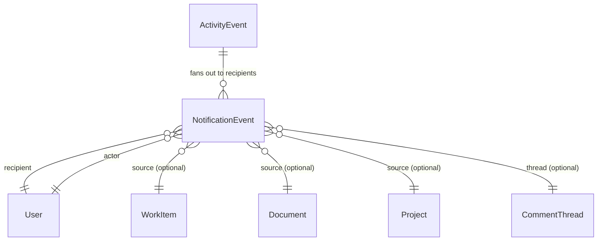
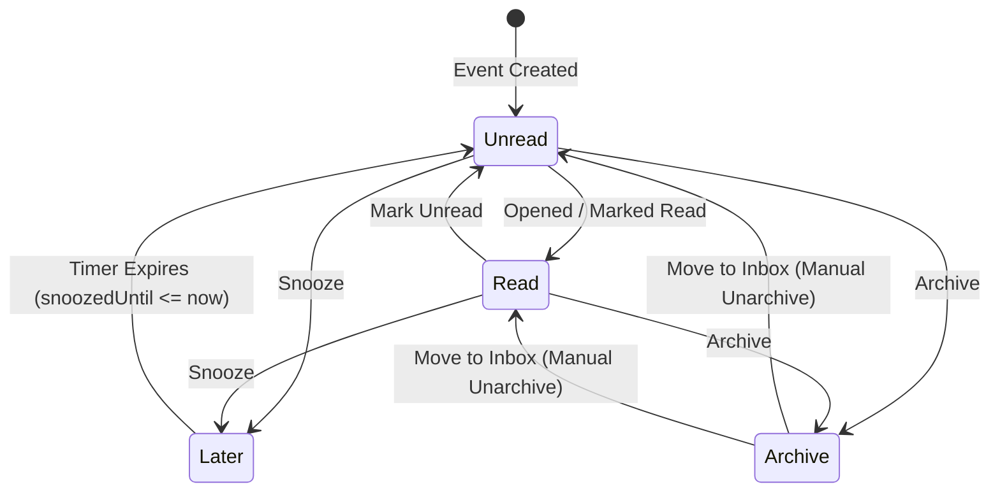

# UI-04A — Personal Triage Inbox Product & UX Contract

- **Document Version:** `1.1.0`
- **Surface Identifier:** `PER-001` (Personal Triage Inbox)
- **Status:** **PROPOSED PRODUCT & UX SPECIFICATION — CORRECTION PASS 01A AT HUMAN REVIEW**
- **Lineage:** `docs/06-complete-page-and-surface-registry.md` $\rightarrow$ `docs/10-ui-02a-application-shell-sidebar-contract.md` $\rightarrow$ `docs/12-ui-03a-my-work-product-ux-contract.md` $\rightarrow$ `docs/14-ui-04a-personal-inbox-product-ux-contract.md`
- **Baseline Git SHA:** `6fe888dff789d3ee0bf99adabd8cf2e800306982`

---

## 1. Executive Summary & Purpose

`PER-001: Personal Triage Inbox` is the centralized, keyboard-first awareness and triage queue for every authenticated user in the Orynqo platform. It answers the fundamental operational question:

> **"What changed, arrived, or requires my awareness or response?"**

Inbox is an event-driven processing stream, **not** an execution backlog. It exists to clear noise, process asynchronous arrivals, acknowledge updates, and route actionable requests into execution without losing context or interrupting deep work.

### 1.1. Core Invariants
1. **Awareness & Response Queue, NOT a Task Backlog:** 
   - `My Work (PER-002)` answers: *"What work should I actively execute next?"* (Projections over canonical `WorkItem`).
   - `Inbox (PER-001)` answers: *"What happened that I should know about or respond to?"* (Projections over recipient-specific `NotificationEvent`).
2. **Personal Triage (`PER-001`) vs. Team Intake Triage (`TEM-006`):**
   - `PER-001` is strictly personal to the authenticated recipient (mentions, thread replies, direct assignments, reviews, approvals, subscribed changes).
   - `TEM-006` is a shared team intake desk for unrouted, externally submitted, or unclassified bugs and customer issues. `PER-001` must **never** absorb `TEM-006`.
3. **Zero Cloned Work Entities:** Inbox renders lightweight, recipient-specific notification events linked to canonical source entities (`WorkItem`, `Document`, `Project`, `Initiative`, `CommentThread`). It never clones domain entities (no `InboxTask`, `InboxComment`, `InboxDoc`).
4. **Calm, High-Density Triage:** Rejects card-heavy feeds, oversized avatars, decorative empty-state heroes, and gamified animations. Inbox is designed for rapid keyboard triage (`j`/`k`, `e` to archive, `z` to snooze, `u` to toggle read) with instant contextual inspection.
5. **Architectural Alignment:**
   - `SIDEBAR = WHERE` (Navigates to `Inbox` with live unread badge)
   - `RESOURCE NAVIGATION = WHAT` (Tabs: `Focus`, `All`, `Later`, `Archive`)
   - `TOOLBAR & FILTERS = HOW` (Filter by event type, entity type, actor; search)
   - `INSPECTOR / CONTEXTUAL DETAIL = DETAIL WITHOUT CONTEXT LOSS` (Split-pane inspection routed by source entity)
   - `COMMAND PALETTE = LONG-TAIL` (`⌘K` commands and shortcuts)

---

## 2. Competitive Research Findings

Before finalizing this contract, official documentation and workflows were analyzed across four primary benchmarks: **Linear**, **Asana**, **ClickUp 3.0**, and **Notion**.

```text
┌────────────────────────────────────────────────────────────────────────────────────────────────────────┐
│                                 COMPETITIVE INBOX BENCHMARK MATRIX                                      │
├─────────────┬─────────────────────┬───────────────────┬────────────────────┬───────────────────────────┤
│ Dimension   │ Linear              │ Asana             │ ClickUp 3.0        │ Notion                    │
├─────────────┼─────────────────────┼───────────────────┼────────────────────┼───────────────────────────┤
│ Core Model  │ Fast triage feed    │ Notification feed │ Multi-tab triage   │ Notification stream       │
│ Tab Layout  │ Unified feed + sub- │ Main, Archive,    │ Primary, Other,    │ Unread, All, Archived     │
│             │ views via filters   │ custom saved tabs │ Later, Cleared     │                           │
│ Snooze      │ Yes (`H`)           │ No native snooze  │ Yes (`Z` / Later)  │ No native snooze          │
│ Clear / Done│ Delete/Archive      │ Archive           │ Clear              │ Archive                   │
│ Detail View │ Side-by-side split  │ Right task pane   │ Right task pane    │ Page jump / side peek     │
│ Keyboard    │ Full (`J/K, U, H`)  │ Partial shortcuts │ Basic navigation   │ Minimal shortcuts         │
│ Noise Guard │ Subscribed issues   │ Project following │ Priority vs Other  │ Page-level notifications  │
│ Team Triage │ Separated (`G T`)   │ Project backlog   │ Team List queue    │ Database inbox view       │
└─────────────┴─────────────────────┴───────────────────┴────────────────────┴───────────────────────────┘
```

### 2.1. Patterns Adopted by Orynqo
1. **Separation of Personal Inbox (`PER-001`) from Team Triage (`TEM-006`):** Adopted Linear's strict architectural separation between personal notification processing and team backlog triage.
2. **Four-State Triage Model (`Focus | All | Later | Archive`):** Adapted ClickUp's distinction between direct attention items and broad project subscriptions, combined with Linear's snooze and archive speed.
3. **Split-Pane Context Preservation:** Adopted Linear and Asana's pattern of embedding the canonical entity detail/inspector directly beside the triage feed so that triaging does not require full-page navigation.
4. **Zero-Mouse Keyboard Triage:** Adopted Linear's high-speed semantic commands for navigation, archiving, snoozing, and inline actions.

### 2.2. Patterns Deliberately Rejected
1. **Opaque "AI Priority" Sorting:** Rejected black-box algorithmic feeds that randomly rearrange items while the user is actively working. Priority in Orynqo is explainable, deterministic, and rule-based.
2. **Card-Soup UI (ClickUp / Slack style):** Rejected bulky cards with 24px padding and large avatars that fit only 3–4 items on a 1080p screen. Orynqo mandates a dense, compact scannable row contract.
3. **Destructive "Delete All / Mark All Done":** Rejected blanket bulk actions like "Resolve All" that conflate notification clearing with domain work resolution.
4. **Lack of Native Snooze (Asana / Notion):** Rejected forcing users to leave unread notifications sitting in the primary inbox as pseudo-reminders.

---

## 3. Critical Product Boundaries

```text
┌────────────────────────────────────────────────────────────────────────────────────────────────────────┐
│                                   THREE-TIER WORKSPACE AWARENESS BOUNDARY                              │
├────────────────────────────────┬───────────────────────────────────┬───────────────────────────────────┤
│ PER-001: Personal Inbox        │ PER-002: My Work                  │ TEM-006: Team Triage              │
├────────────────────────────────┼───────────────────────────────────┼───────────────────────────────────┤
│ • "What happened to my items?" │ • "What must I execute today?"    │ • "What new work entered team?"   │
│ • Recipient-specific events    │ • Canonical WorkItems (assignee)  │ • Unassigned incoming requests    │
│ • Mentions, approvals, replies │ • In Progress, Overdue, Due Soon  │ • Customer bugs, escalation queue │
│ • Cleared via Archive / Snooze │ • Cleared via WorkItem completion │ • Cleared via Accept / Decline    │
│ • Ephemeral awareness stream   │ • Persistent execution workbench  │ • Shared squad triage desk        │
└────────────────────────────────┴───────────────────────────────────┴───────────────────────────────────┘
```

### 3.1. Work Items vs. Notification Events
- A user assigned to `ENG-104` has `ENG-104` listed in **My Work (`PER-002`)**.
- When a teammate comments *"@marcus heads up on this commit"* on `ENG-104`, Marcus receives a `NotificationEvent` in **Personal Inbox (`PER-001`)**.
- Archiving the notification in Inbox **does not** change `ENG-104`'s status, assignment, or presence in My Work.
- Completing `ENG-104` in My Work **does not** delete the comment notification from Inbox history.

### 3.2. Team Triage vs. Personal Inbox
- An unassigned customer bug reported via API lands in **Team Triage (`TEM-006`)** for the Core Platform team.
- No individual receives a Personal Inbox notification unless the team triage rule assigns it or explicitly mentions an on-call engineer.
- Once the triage lead assigns the bug to Marcus, `TEM-006` removes it, and Marcus receives an assignment event in **`PER-001`**.

---

## 4. Canonical Data Model & Relationship Topology

Inbox is an authoritative projection over `NotificationEvent` entities.



### 4.1. Conceptual Entity Definition: `NotificationEvent`

To guarantee zero metadata leakage upon access revocation while supporting efficient querying, `NotificationEvent` separates durable notification metadata from dynamic render projections:

```typescript
interface NotificationEvent {
  // Durable Notification Metadata (Safe lifecycle & routing data)
  id: string;                          // Unique UUID (e.g. 'notif-91823')
  workspaceId: string;                 // Workspace tenant boundary
  recipientUserId: string;             // Authenticated owner of this inbox item
  actorUserId?: string;                // Triggering user (or 'system'); filtered if actor restricted
  eventType: NotificationEventType;    // e.g. 'mention', 'assigned', 'review_requested'
  sourceEntityType: 'work_item' | 'document' | 'project' | 'initiative' | 'access_request';
  sourceEntityId: string;              // Canonical target ID (e.g. 'wi-eng-104')
  threadId?: string;                   // Associated CommentThread ID if applicable
  activityEventId?: string;            // Pointer to immutable product activity event

  // Lifecycle & State
  createdAt: string;                   // ISO-8601 UTC timestamp
  readAt: string | null;               // Null if unread, timestamp when read
  archivedAt: string | null;           // Null if active, timestamp when archived
  snoozedUntil: string | null;         // Null if unsnoozed, future timestamp if in Later

  // Classification & Bundling Identity
  importance: 'focus' | 'normal';      // Deterministic priority tier
  responseRequired: boolean;           // True if item requires explicit recipient response
  bundleKey: string;                   // Collapsing key for stream grouping
  dedupeKey: string;                   // Idempotent delivery key

  // Render Projection (Authorization-sensitive display payload)
  // MUST be permission-filtered at query/render boundary; client NEVER treats as auth-independent
  renderPayload?: {
    title: string;                     // Permission-authorized entity title
    summary: string;                   // Descriptive action text
    bodySnippet?: string;              // Short comment or description excerpt
    identifier?: string;               // e.g. "ENG-104"
    status?: string;                   // Source status snapshot
    priority?: string;                 // Source priority snapshot
  };

  // Safe Tombstone State
  isRedacted?: boolean;                // True if access to source entity was revoked
  redactedReason?: 'access_revoked' | 'entity_deleted';
}
```

### 4.2. ActivityEvent vs. NotificationEvent Architectural Invariant
- **`ActivityEvent` is an immutable canonical product/domain activity history** describing meaningful actions or state transitions (e.g., *"Sarah changed status of ENG-104 to In Review at 14:02:11Z"*). It may be displayed in surfaces such as Project Activity. It is **NOT** the enterprise security/audit system. Enterprise audit and compliance remain separate under the existing enterprise architecture (`ADM-002`).
- **`NotificationEvent` is a personal, mutable delivery projection** created for a specific `recipientUserId`. Marking a notification as read, archiving it, or snoozing it mutates `NotificationEvent.readAt`, `archivedAt`, or `snoozedUntil`, leaving the canonical `ActivityEvent` completely untouched.
- One `ActivityEvent` fans out to $0..N$ `NotificationEvents` (e.g., $0$ for routine self-actions, $1$ for direct assignments, or many for an announcement on a followed project).
- Notification state changes **never** mutate `ActivityEvent`.

---

## 5. Event Taxonomy & Action Matrix

Every event in Orynqo belongs to one of four deterministic families. The classification separates **Importance** (`Focus` vs `Normal`) from **Action Requirement** (`responseRequired: boolean`):

```text
┌────────────────────────────────────────────────────────────────────────────────────────────────────────────────────────┐
│                                                NOTIFICATION EVENT TAXONOMY                                             │
├─────────────────────┬───────────────────┬────────────┬──────────────────┬─────────────┬───────────────────┬────────────┤
│ Event Type          │ Recipient Trigger │ Importance │ Response Req?    │ Bundleable? │ Inline Actions    │ Source Type│
├─────────────────────┼───────────────────┼────────────┼──────────────────┼─────────────┼───────────────────┼────────────┤
│ DIRECT ATTENTION    │                   │            │                  │             │                   │            │
│ • mention           │ @mentioned in text│ Focus      │ Expected (true)  │ No          │ Reply, Mark Read  │WorkItem/Doc│
│ • thread_reply      │ Reply in thread   │ Focus      │ Optional (false) │ Yes (thread)│ Reply, Resolve    │WorkItem/Doc│
│ • assigned          │ Assigned to me    │ Focus      │ Awareness (false)│ No          │ Change Status, Ack│WorkItem    │
│ • review_requested  │ Reviewer assigned │ Focus      │ Required (true)  │ No          │ Open, Start Review│WorkItem/Doc│
│ • approval_request  │ Gating approval   │ Focus      │ Required (true)  │ No          │ Approve, Deny     │Access/Proj │
│ • access_request    │ Asset access req  │ Focus      │ Required (true)  │ No          │ Grant, Reject     │Workspace   │
│ • invitation        │ Workspace/Team inv│ Focus      │ Required (true)  │ No          │ Accept, Decline   │Workspace   │
├─────────────────────┼───────────────────┼────────────┼──────────────────┼─────────────┼───────────────────┼────────────┤
│ WORK CHANGES        │                   │            │                  │             │                   │            │
│ • status_changed    │ Followed item     │ Normal     │ False            │ Yes (item)  │ Open, Mark Read   │WorkItem    │
│ • priority_changed  │ Followed item     │ Normal     │ False            │ Yes (item)  │ Open, Mark Read   │WorkItem    │
│ • due_date_changed  │ Followed item     │ Normal     │ False            │ Yes (item)  │ Open, Mark Read   │WorkItem    │
│ • dependency_blocked│ Owned item blocked│ Focus      │ Awareness (false)│ No          │ View Blocker, Ack │WorkItem    │
│ • dependency_cleared│ Blocker resolved  │ Normal     │ False            │ No          │ Open WorkItem     │WorkItem    │
├─────────────────────┼───────────────────┼────────────┼──────────────────┼─────────────┼───────────────────┼────────────┤
│ COLLABORATION       │                   │            │                  │             │                   │            │
│ • comment_added     │ Subscribed item   │ Normal     │ False            │ Yes (item)  │ Reply, Mark Read  │WorkItem/Doc│
│ • thread_resolved   │ Thread participant│ Normal     │ False            │ Yes (thread)│ Reopen, Ack       │WorkItem/Doc│
│ • reaction_added    │ Comment author    │ Normal     │ False            │ Yes (react) │ Mark Read         │WorkItem/Doc│
├─────────────────────┼───────────────────┼────────────┼──────────────────┼─────────────┼───────────────────┼────────────┤
│ PROJECT & MILESTONE │                   │            │                  │             │                   │            │
│ • health_changed    │ Subscribed project│ Normal     │ False            │ No          │ View Update       │Project/Int │
│ • milestone_slipped │ Subscribed project│ Focus      │ Awareness (false)│ No          │ View Milestone    │Project/Int │
├─────────────────────┼───────────────────┼────────────┼──────────────────┼─────────────┼───────────────────┼────────────┤
│ TIME-SENSITIVE      │                   │            │                  │             │                   │            │
│ • overdue_transition│ Assignee (policy) │ Focus      │ Awareness (false)│ No          │ Open in My Work   │WorkItem    │
│ • personal_reminder │ Remind-me trigger │ Focus      │ Awareness (false)│ No          │ Open, Re-snooze   │Any         │
│ • snooze_returned   │ Snoozer           │ Focus      │ Awareness (false)│ No          │ Open, Re-snooze   │Any         │
└─────────────────────┴───────────────────┴────────────┴──────────────────┴─────────────┴───────────────────┴────────────┘
```

---

## 6. Self-Generated Event Policy & My Work Noise Prevention

### 6.1. Self-Generated Event Policy
To eliminate operational noise:
1. **Strict Suppressive Default:** Routine actions executed by the user (e.g., commenting, editing status, changing priorities, assigning someone else, creating issues) **MUST NOT** generate a `NotificationEvent` for the actor themselves.
2. **Explicit User Reminders Allowed:** Self-originated events generate notifications **only** when explicitly configured by the user as a delayed trigger:
   - Setting a personal reminder on an issue or doc (*"Remind me tomorrow at 9 AM"*).
   - A snoozed notification returning to the active inbox when its timer expires.

### 6.2. Separation from My Work Attention
My Work (`PER-002`) continuously tracks execution health (Overdue, Due Today, Blocked, In Progress). Inbox does **not** duplicate this by continually generating recurring daily alerts for overdue tasks.
- **Principle:** *Inbox receives time-sensitive WorkItem notifications only when an explicit notification or reminder policy produces a discrete, meaningful event.*
- **Permitted Events:**
  - Initial transition into `overdue` status (one-shot alert).
  - Explicit user-configured reminder (*"Remind me 1 hour before due"*).
  - Significant schedule escalation (e.g., due date moved up by project lead).
- My Work remains the continuous source of truth for execution scheduling. Inbox must not spam the user with redundant daily overdue warnings.

---

## 7. Information Architecture & Primary Tabs

Inbox uses a streamlined **4-tab information architecture** in the ContextBar resource nav:

```text
INBOX (PER-001)
├── Focus       (Elevated personal attention: mentions, direct requests, ownership impacts, blockers, reminders)
├── All         (Complete active feed: Focus items + general property updates + followed activity)
├── Later       (Snoozed notifications awaiting scheduled return)
└── Archive     (Cleared notifications: historical log of processed events)
```

```text
┌────────────────────────────────────────────────────────────────────────────────────────────────────────┐
│ ContextBar:  Inbox  /  [Focus (3)]  [All (14)]  [Later (2)]  [Archive]        [Filter] [Search] [Mark All Read] │
└────────────────────────────────────────────────────────────────────────────────────────────────────────┘
```

### 7.1. Tab Definitions & Invariants
- **`Focus`:** Contains notifications with elevated personal attention relevance, including direct requests, direct mentions, ownership-impacting changes, blockers, and time-sensitive policy events. It does not force every item to require an explicit response.
- **`All`:** The comprehensive active inbox. Displays all unarchived, unsnoozed notifications chronologically.
- **`Later`:** Holds notifications with `snoozedUntil > now`. When the timestamp arrives, the item automatically transitions back to active triage.
- **`Archive`:** A searchable, reversible log of cleared items. Does not generate unread count badges.

### 7.2. Explicit Badge & Count Semantics
- **Sidebar Inbox Badge:** Displays the count of **unread active notifications** within the current workspace scope (`readAt === null && archivedAt === null && (snoozedUntil === null || snoozedUntil <= now)`).
- **Focus Tab Count (`Focus (3)`):** Displays active unsnoozed, unarchived notifications classified as `Focus`.
- **All Tab Count (`All (14)`):** Displays the total number of **active, unarchived, unsnoozed notifications** in the active triage queue.
- **Later & Archive Counts:** Later and Archive tabs never inflate the Sidebar unread badge.

---

## 8. Grouping, Bundling & Lifecycle Identity

### 8.1. Deterministic Bundling Rules
Events are bundled dynamically if and only if they share:
$$\text{Recipient} + \text{SourceEntityId} + \text{CompatibleEventFamily} + \text{BoundedTimeWindow (configurable)}$$

- **Tunable Policy Value:** `bundleWindow` is a configurable workspace/platform parameter (default: 4 hours). It is not hardcoded architecture.
- **Eligible for Bundling:**
  - Multiple comments on the same WorkItem: *"Sarah Jenkins and 3 others commented on ENG-104"*
  - Multiple property updates on the same WorkItem: *"Alex Chen changed status, priority, and cycle on ENG-201"*
  - Multiple reactions on an authored comment: *"Alex, Priya, and 4 others reacted with 👍"*
- **Strictly Ineligible for Bundling:**
  - Direct @mentions: Every direct mention retains its individual semantic prominence.
  - Distinct approval/access requests: Cannot be combined into a single ambiguous card.
  - Separate source entities: Never bundle updates from different tasks/docs together.

### 8.2. Presentation-Only Bundle Identity Invariant
- **A bundle is a query and presentation projection, NOT a persistent canonical database entity.**
- Individual `NotificationEvent` records retain their unique IDs, timestamps, and lifecycles.
- Performing triage operations (archive, read, snooze) on a bundle resolves under the hood to the discrete array of child `NotificationEvent.id`s.
- **Archive & Subsequent Activity Semantics:** 
  - *Archived NotificationEvents remain permanently archived.*
  - When new activity occurs on a source entity that has archived notifications, a **new** `NotificationEvent` is created and delivered to the active Inbox.
  - The query layer may visually associate the new event with historical archived entries for context, but historical archived events are **never resurrected** or unarchived automatically.

---

## 9. State Machine: Read, Snooze, Archive & Resolve



```text
┌────────────────────────────────────────────────────────────────────────────────────────────────────────┐
│                                      INBOX STATE COMPARISON MATRIX                                     │
├───────────────┬──────────────────────┬──────────┬─────────────────────────────┬────────────────────────┤
│ State         │ Where Visible        │ Unread?  │ Returns to Active?          │ Mutation Applied       │
├───────────────┼──────────────────────┼──────────┼─────────────────────────────┼────────────────────────┤
│ Active/Unread │ Focus / All          │ Yes (●)  │ N/A (Already in active)     │ Initial state          │
│ Active/Read   │ Focus / All          │ No       │ N/A (Already in active)     │ readAt = now           │
│ Later         │ Later                │ Preserved│ Yes (when snoozedUntil<=now)│ snoozedUntil=timestamp │
│ Archive       │ Archive              │ No       │ Never (New event creates    │ archivedAt = now       │
│               │                      │          │ new NotificationEvent)      │                        │
│ Resolved      │ (Canonical Entity)   │ N/A      │ N/A (Domain state)          │ entity.status = 'done' │
└───────────────┴──────────────────────┴──────────┴─────────────────────────────┴────────────────────────┘
```

### 9.1. Essential Invariant: Read $\neq$ Resolved
- Marking an approval request as "Read" does **not** approve the request.
- Archiving a "Blocked Dependency" notification does **not** unblock the task.
- Marking an @mention as "Read" does **not** resolve the discussion thread.
- Domain resolutions require explicit domain mutations executed via canonical feature APIs.

---

## 10. Split-Pane Contextual Detail Model & Capability Routing

Inbox maintains high-velocity triage through a split-pane layout (`Inbox stream | Contextual Detail / Inspector`).

```text
┌───────────────────────────────────────────────┬────────────────────────────────────────────────────────┐
│ INBOX STREAM (Design token default ~400-420px)│ CONTEXTUAL DETAIL / INSPECTOR (Remaining canvas)       │
├───────────────────────────────────────────────┼────────────────────────────────────────────────────────┤
│ ● [Focus] ENG-104 (Selected)           2h ago │ ENG-104 · WAL Compression and Segment Rotation         │
│   Sarah mentioned you in comment              │ Status: [In Progress ▾]  Priority: [High ▾]           │
│ ───────────────────────────────────────────── │ Team: Core Engine       Assignee: Marcus Vance         │
│   [Focus] PRD-012 Living Spec RFC      5h ago │ ────────────────────────────────────────────────────── │
│   Alex Chen requested your review             │ Sarah Jenkins (2h ago):                                │
│ ───────────────────────────────────────────── │ "@marcus heads up on this commit before rotation."     │
│   [All] ENG-201 Priority Changed       1d ago │ ┌────────────────────────────────────────────────────┐ │
│   Priya changed priority to Urgent            │ │ [Reply inline...]                              (↵) │ │
│                                               │ └────────────────────────────────────────────────────┘ │
└───────────────────────────────────────────────┴────────────────────────────────────────────────────────┘
```

### 10.1. Capability-Aware Contextual Routing
Inbox mounts contextual detail based on the source entity type and available canonical surfaces:
1. **`work_item`:** Mounts the frozen canonical `WorkItemInspector` (`WRK-005`), scrolled directly to the relevant comment thread, status change, or blocker.
2. **`document`:** Routes to the best available canonical Document context. If dedicated living spec inspector surfaces are post-core or unimplemented, mounts document contextual preview or provides deep-link navigation to the canonical Document route.
3. **`project`:** Mounts Project-specific context (`PRJ-002`) when available.
4. **`initiative`:** Mounts Initiative-specific context (`INT-002`). Initiative detail does not fall back to generic Project Overview.
5. **`access_request` / `approval_request`:** Mounts the canonical request action dialog or permission panel when available. If the domain capability is unimplemented, displays safe notification context with canonical route navigation.
6. *No fake domain inspectors are invented for unimplemented surfaces.*

---

## 11. Inbox Row Anatomy & Visual Tokens

Inbox rows enforce extreme information density with clear typographic hierarchy:

```text
┌────────────────────────────────────────────────────────────────────────────────────────────────────────┐
│ ● [Importance] [Actor Avatar]  [Source Identifier] [Source Title]                     [Timestamp] [···]│
│   [Action Summary Badge]  "Snippet text of comment or property change preview..."                      │
└────────────────────────────────────────────────────────────────────────────────────────────────────────┘
```

### 11.1. Visual Tokens & Candidate Metrics
- **Dimensions:** Row height defaults to compact design tokens (~36px–44px), subject to visual validation in UI-04B.
- **Unread Indicator:** High-contrast solid dot with accessible label.
- **Importance Marker:** Distinct visual icon/badge for `Focus` items.
- **Actor Avatar:** Compact circular avatar with fallback initials.
- **Identifier:** Monospace font (`var(--font-mono)`), color `var(--text-muted)`.
- **Title:** Truncated bold single-line text, color `var(--text-primary)`.
- **Summary Line:** Secondary muted text, color-coded action badge.
- **Timestamp:** Compact relative string (`2m`, `1h`, `3d`).

---

## 12. Keyboard Triage Contract

Inbox is keyboard-first, adhering to Orynqo's frozen keyboard scope hierarchy:
$$\text{GLOBAL} \rightarrow \text{PAGE/VIEW} \rightarrow \text{OVERLAY} \rightarrow \text{EDITABLE CONTROL}$$

### 12.1. Frozen Semantic Commands & Provisional Keybindings
Physical keybindings are proposed candidates and remain provisional until validated against the global shortcut registry:

```text
┌────────────────────────────────────────────────────────────────────────────────────────────────────────┐
│                                       KEYBOARD SHORTCUT CONTRACT                                       │
├─────────────────────┬───────────────────┬──────────────────────────────────────────────────────────────┤
│ Semantic Command    │ Provisional Keys  │ Scope & Behavior                                             │
├─────────────────────┼───────────────────┼──────────────────────────────────────────────────────────────┤
│ Next Item           │ `j` / `↓`         │ Move selection to next notification in stream                │
│ Previous Item       │ `k` / `↑`         │ Move selection to previous notification in stream            │
│ Open / Inspect      │ `Enter` / `Space` │ Focus detail panel or expand bundle                          │
│ Archive             │ `e`               │ Archive active item; advance selection down automatically    │
│ Archive All Read    │ `Shift + e`       │ Archives all read notifications in active tab                │
│ Toggle Read/Unread  │ `u`               │ Toggles unread state of selected item                        │
│ Snooze (Later)      │ `z` / `h`         │ Opens quick snooze picker popover                            │
│ Quick Reply         │ `r`               │ Focuses comment reply input in inspection pane               │
│ Open Source Entity  │ `o`               │ Navigates directly to full resource canvas (Doc/Project/Team)│
│ Multi-Select Range  │ `Shift + j/k`     │ Extends selection range for bulk operations                  │
│ Clear Selection     │ `Escape`          │ Deselects multi-select; closes inspector pane                │
└─────────────────────┴───────────────────┴──────────────────────────────────────────────────────────────┘
```

### 12.2. Focus Protection Invariants
- When an editable input (reply box, search field) is focused, single-key commands (`j`, `k`, `e`, `z`, `u`) are strictly suppressed.
- Pressing `Escape` inside an editable input restores focus to the active Inbox row.
- Archiving an item automatically advances focus to the adjacent row.

---

## 13. Bulk Operations Contract

```text
┌────────────────────────────────────────────────────────────────────────────────────────────────────────┐
│                                       BULK TRIAGE CAPABILITY MATRIX                                    │
├─────────────────────────┬──────────────┬───────────────────────────────────────────────────────────────┤
│ Action                  │ Permitted?   │ Architectural Guardrail                                       │
├─────────────────────────┼──────────────┼───────────────────────────────────────────────────────────────┤
│ Bulk Mark as Read       │ YES          │ Safe idempotent mutation over selected notification IDs       │
│ Bulk Mark as Unread     │ YES          │ Safe idempotent mutation over selected notification IDs       │
│ Bulk Archive            │ YES          │ Moves notifications to Archive; does NOT mutate domain items  │
│ Bulk Snooze             │ YES          │ Applies shared `snoozedUntil` timestamp to selected IDs       │
│ Bulk "Resolve All"      │ STRICTLY NO  │ BANNED: Notifications represent heterogeneous work.           │
│ Bulk "Approve All"      │ STRICTLY NO  │ BANNED: Gating approvals must be confirmed individually.      │
│ Bulk "Change Status"    │ STRICTLY NO  │ BANNED: Status updates belong in DataGrid bulk action bar.    │
└─────────────────────────┴──────────────┴───────────────────────────────────────────────────────────────┘
```

---

## 14. Filtering, Sorting, and Search

### 14.1. Filtering Dimensions
- **Importance:** `Focus only` vs `All items`.
- **Action Requirement:** `Response required` vs `All`.
- **Event Type:** `Mentions`, `Assignments`, `Reviews & Approvals`, `Updates & Activity`.
- **Source Type:** `Work Items`, `Documents`, `Projects & Initiatives`.
- **Read State:** `Unread only` vs `All`.

### 14.2. Deterministic Sorting
- **Default Sort (`Newest`):** Ordered by `createdAt` descending, with `id` as deterministic tie-breaker.
- **Focus Priority Sort:** `Focus` items first, ordered by urgency and `createdAt` descending.
- *Opaque AI-driven ranking is rejected.*

### 14.3. Authoritative Search & Security
- Search executes server-side across notification summaries, comment snippets, source identifiers, and titles.
- **Authoritative Filtering:** Authorization filtering is authoritative at the query/search boundary. Inaccessible or revoked entities are completely stripped from search results before network responses are returned.

---

## 15. Real-Time Delivery & Triage Stability

Inbox supports incremental delivery of newly available `NotificationEvents` without requiring a full-page refresh. Transport selection (WebSocket, SSE, or polling fallback) remains an implementation/backend architecture decision.

### 15.1. The Triage Stability Rule
1. **Never Jump the Viewport:** When the user is actively navigating rows or inspecting an item, incoming events **must not** abruptly push down the row under the cursor or steal focus.
2. **Visual Inflow Banner:** When new events arrive during an active triage session, an unobtrusive banner appears at the top:
   ```text
   [ ↑ 3 new notifications ]
   ```
3. **Flushing the Queue:** Clicking the banner or pressing `.` (period) smoothly inserts the new items at the top of the stream.
4. **Tunable Idle Inflow:** When user interaction is idle (policy-configurable, e.g. ~30 seconds), new items insert safely without focus disruption.

---

## 16. Security, RBAC & Zero-Leakage Permissions

1. **Authoritative Server/Query Boundary:**
   - Authorization filtering is strictly authoritative at the data/query boundary. Client-side hiding is purely defense-in-depth and transition handling.
   - When a user loses access to a project, document, or team, queries and search indices must never return the revoked entity's title, comments, identifiers, or actor metadata.
2. **Safe Tombstone Contract:**
   - In the event that a notification ID exists in cached client state when permission is revoked, the row renders a safe tombstone:
     > *"This item is no longer accessible."*
   - Title, snippets, and identifiers are completely redacted.
3. **Inspector Auto-Close:** If the user is inspecting an item in the detail pane when access is revoked, the inspector automatically closes safely with a generic notice: *"Access to this item has changed."*
4. **Scope Across All Views:** Applies equally to active views, `Later`, `Archive`, search, and bundles.

---

## 17. Proposed Component Architecture (`features/inbox/`)

```text
src/features/inbox/
├── components/
│   ├── InboxCockpit.jsx          // Master container (Split-pane layout router)
│   ├── InboxStream.jsx           // Virtualized stream list of rows & bundles
│   ├── InboxRow.jsx              // High-density individual notification row
│   ├── InboxBundle.jsx           // Presentation bundle container for grouped updates
│   ├── InboxToolbar.jsx          // ContextBar toolbar (Filter, Search, Archive Read)
│   ├── InboxDetailRouter.jsx     // Routes selection to WorkItem / Doc / Project Inspector
│   ├── InboxEmptyState.jsx       // High-density, calm "Caught Up" state
│   ├── InboxBulkBar.jsx          // Multi-select bulk triage floating action bar
│   └── SnoozePopover.jsx         // Quick-date presets (Later today, Tomorrow, Custom)
├── hooks/
│   ├── useInboxQuery.js          // Query boundary: cursor pagination, filtering, unread count
│   ├── useInboxMutations.js      // MarkRead, Archive, Snooze (optimistic with rollback)
│   ├── useInboxKeyboard.js       // J/K/E/Z/U/R keyboard triage engine
│   └── useInboxPreferences.js    // Active tab, filter presets, snooze defaults in localStorage
├── model/
│   ├── eventTaxonomy.js          // Definitions of all event types, badges, and icons
│   ├── importanceClassifier.js   // Deterministic Focus vs Normal ranking rules
│   └── bundler.js                // Pure function grouping events into presentation bundles
└── index.js                      // Public surface exports
```

---

## 18. Query & Mutation Contracts

### 18.1. Query Hook Contract: `useInboxQuery`
```typescript
interface InboxQueryOptions {
  workspaceId: string;
  recipientId: string;
  tab: 'focus' | 'all' | 'later' | 'archive';
  filters?: {
    importance?: 'focus' | 'normal';
    responseRequired?: boolean;
    eventTypes?: string[];
    sourceTypes?: string[];
    isUnreadOnly?: boolean;
    searchQuery?: string;
  };
  cursor?: string;                     // Deterministic keyset (createdAt + id)
  limit?: number;
}

interface InboxQueryResult {
  items: (NotificationEvent | NotificationBundleProjection)[];
  unreadCount: number;                 // Sidebar workspace badge count
  focusCount: number;                  // Focus tab active count
  totalActiveCount: number;            // All tab active count
  pageInfo: {
    hasNextPage: boolean;
    endCursor: string | null;
  };
  isLoading: boolean;
  error: Error | null;
  fetchNextPage: () => Promise<void>;
  refetch: () => Promise<void>;
}
```

### 18.2. Mutation Hook Contract: `useInboxMutations`
`useInboxMutations` owns **strictly** `NotificationEvent` lifecycle mutations:
```typescript
interface InboxMutations {
  markAsRead: (eventIds: string[]) => Promise<void>;
  markAsUnread: (eventIds: string[]) => Promise<void>;
  archiveEvents: (eventIds: string[]) => Promise<void>;
  unarchiveEvents: (eventIds: string[]) => Promise<void>;
  snoozeEvents: (eventIds: string[], until: string) => Promise<void>;
  unsnoozeEvents: (eventIds: string[]) => Promise<void>;
  archiveAllRead: () => Promise<void>;
}
```
*Domain actions (replying, resolving threads, updating work item status, granting access) delegate directly to their respective canonical domain APIs (e.g., Comments feature, WorkItem feature, Access feature) and are NOT owned by Inbox mutations.*

---

## 19. Responsive Layout Adaptations

Breakpoints and exact widths are tunable design-system token values subject to visual validation in UI-04B:

```text
┌────────────────────────────────────────────────────────────────────────────────────────────────────────┐
│                                      RESPONSIVE LAYOUT MATRIX                                          │
├─────────────────────┬─────────────────────────────┬────────────────────────────────────────────────────┤
│ Semantic Mode       │ Canvas Behavior             │ Detail & Inspection Behavior                       │
├─────────────────────┼─────────────────────────────┼────────────────────────────────────────────────────┤
│ Wide Mode           │ Stream list (~400px default)│ Embedded side-by-side inspection pane on the right │
│ (Desktop)           │ on the left                 │ with instant cross-row navigation.                 │
├─────────────────────┼─────────────────────────────┼────────────────────────────────────────────────────┤
│ Compact Mode        │ Full-width stream           │ Drawer overlay slides in from right over stream;   │
│ (Tablet / Small Win)│                             │ Escape closes drawer and restores stream focus.    │
├─────────────────────┼─────────────────────────────┼────────────────────────────────────────────────────┤
│ Mobile Mode         │ Full-width stream with tap  │ Full-screen sheet push. Back chevron in header     │
│ (Phone)             │ triggers                    │ returns to triage stream.                          │
└─────────────────────┴─────────────────────────────┴────────────────────────────────────────────────────┘
```

---

## 20. Accessibility (Targeting WCAG 2.2 AA)

1. **Semantic Structure & Feed Semantics:** Uses appropriate list/feed semantics suited to high-speed keyboard operation.
2. **Accessible Unread & Importance:** Unread state and importance indicators provide clear programmatic labels and non-color visual distinctions.
3. **Keyboard Navigation & Focus Restoration:** Single-key actions advance selection predictably; unfocusing inputs returns focus to the active row.
4. **Controlled Live Announcements:** Newly arrived notifications trigger non-disruptive announcements without noisy repeated live-region churn.
5. **Reduced Motion:** Fully adheres to `prefers-reduced-motion: reduce`.

---

## 21. Non-Goals & Future Settings Boundary

### 21.1. Explicit Non-Goals
- **No Team Triage Implementation:** Shared intake triage (`TEM-006`) is a separate phase.
- **No Email / Push Infrastructure:** Mobile push gateways and email daemons are outside UI-04.
- **No Chat System:** Inbox is for asynchronous work awareness, not synchronous chat.
- **No AI Prioritization:** Priority is explainable and deterministic.
- **No Implementation Code in UI-04A:** This contract defines specifications only.

### 21.2. Notification Settings Boundary (`PER-003`)
Future personal settings may provide user customization for:
- Subscribed event classes and delivery frequencies.
- Custom reminder offsets.
- Project and team following policies.
- Mute/pause schedules and digests.
*UI-04A does not require PER-003 to exist; it provides robust, deterministic platform defaults.*

---

## 22. Summary & Baseline Status

This document represents **v1.1.0** of the **PER-001: Personal Triage Inbox Product & UX Contract**, incorporating all architectural adjustments from Correction Pass 01A.
