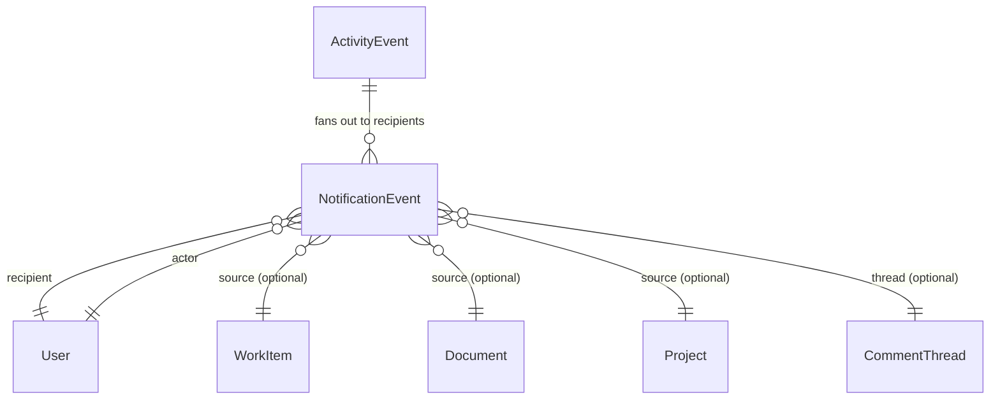
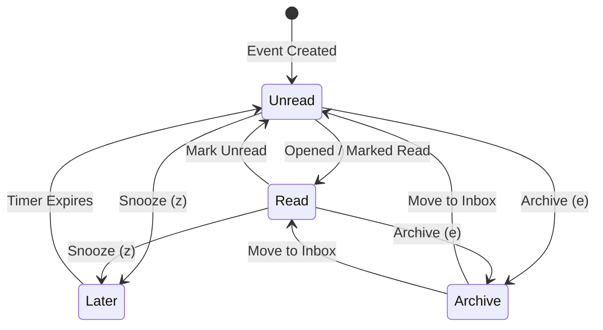

# UI-04A — Personal Triage Inbox Product & UX Contract

- **Document Version:** `1.0.0`
- **Surface Identifier:** `PER-001` (Personal Triage Inbox)
- **Status:** **PROPOSED PRODUCT & UX SPECIFICATION — FROZEN AT HUMAN REVIEW**
- **Lineage:** `docs/06-complete-page-and-surface-registry.md` $\rightarrow$ `docs/10-ui-02a-application-shell-sidebar-contract.md` $\rightarrow$ `docs/12-ui-03a-my-work-product-ux-contract.md` $\rightarrow$ `docs/14-ui-04a-personal-inbox-product-ux-contract.md`
- **Baseline Git SHA:** `6fe888dff789d3ee0bf99adabd8cf2e800306982`

---

## 1. Executive Summary & Purpose

`PER-001: Personal Triage Inbox` is the centralized, keyboard-first awareness and triage queue for every authenticated user in the Orynqo platform. It answers the fundamental operational question:

> **"What changed, arrived, or requires my awareness or response?"**

Inbox is an event-driven processing stream, **not** an execution backlog. It exists to clear noise, process asynchronous arrivals, acknowledge updates, and route actionable requests into execution without losing context or interrupting deep work.

### 1.1. Core Invariants
1. **Awareness & Response Queue, NOT a Task Backlog:** 
   - `My Work (PER-002)` answers: *"What work should I actively execute next?"* (Projections over canonical `WorkItem`).
   - `Inbox (PER-001)` answers: *"What happened that I should know about or respond to?"* (Projections over recipient-specific `NotificationEvent`).
2. **Personal Triage (`PER-001`) vs. Team Intake Triage (`TEM-006`):**
   - `PER-001` is strictly personal to the authenticated recipient (mentions, thread replies, direct assignments, reviews, approvals, subscribed changes).
   - `TEM-006` is a shared team intake desk for unrouted, externally submitted, or unclassified bugs and customer issues. `PER-001` must **never** absorb `TEM-006`.
3. **Zero Cloned Work Entities:** Inbox renders lightweight, recipient-specific notification events linked to canonical source entities (`WorkItem`, `Document`, `Project`, `Initiative`, `CommentThread`). It never clones domain entities (no `InboxTask`, `InboxComment`, `InboxDoc`).
4. **Calm, High-Density Triage:** Rejects card-heavy feeds, oversized avatars, decorative empty-state heroes, and gamified animations. Inbox is designed for rapid keyboard triage (`j`/`k`, `e` to archive, `z` to snooze, `u` to toggle read) with instant contextual inspection.
5. **Architectural Alignment:**
   - `SIDEBAR = WHERE` (Navigates to `Inbox` with live unread badge)
   - `RESOURCE NAVIGATION = WHAT` (Tabs: `Focus`, `All`, `Later`, `Archive`)
   - `TOOLBAR & FILTERS = HOW` (Filter by event type, entity type, actor; search)
   - `INSPECTOR / CONTEXTUAL DETAIL = DETAIL WITHOUT CONTEXT LOSS` (Split-pane inspection routed by source entity)
   - `COMMAND PALETTE = LONG-TAIL` (`⌘K` commands and shortcuts)

---

## 2. Competitive Research Findings

Before finalizing this contract, official documentation and workflows were analyzed across four primary benchmarks: **Linear**, **Asana**, **ClickUp 3.0**, and **Notion**.

```text
┌────────────────────────────────────────────────────────────────────────────────────────────────────────┐
│                                 COMPETITIVE INBOX BENCHMARK MATRIX                                      │
├─────────────┬─────────────────────┬───────────────────┬────────────────────┬───────────────────────────┤
│ Dimension   │ Linear              │ Asana             │ ClickUp 3.0        │ Notion                    │
├─────────────┼─────────────────────┼───────────────────┼────────────────────┼───────────────────────────┤
│ Core Model  │ Fast triage feed    │ Notification feed │ Multi-tab triage   │ Notification stream       │
│ Tab Layout  │ Unified feed + sub- │ Main, Archive,    │ Primary, Other,    │ Unread, All, Archived     │
│             │ views via filters   │ custom saved tabs │ Later, Cleared     │                           │
│ Snooze      │ Yes (`H`)           │ No native snooze  │ Yes (`Z` / Later)  │ No native snooze          │
│ Clear / Done│ Delete/Archive      │ Archive           │ Clear              │ Archive                   │
│ Detail View │ Side-by-side split  │ Right task pane   │ Right task pane    │ Page jump / side peek     │
│ Keyboard    │ Full (`J/K, U, H`)  │ Partial shortcuts │ Basic navigation   │ Minimal shortcuts         │
│ Noise Guard │ Subscribed issues   │ Project following │ Priority vs Other  │ Page-level notifications  │
│ Team Triage │ Separated (`G T`)   │ Project backlog   │ Team List queue    │ Database inbox view       │
└─────────────┴─────────────────────┴───────────────────┴────────────────────┴───────────────────────────┘
```

### 2.1. Patterns Adopted by Orynqo
1. **Separation of Personal Inbox (`PER-001`) from Team Triage (`TEM-006`):** Adopted Linear's strict architectural separation between personal notification processing and team backlog triage.
2. **Four-State Triage Model (`Focus | All | Later | Archive`):** Adapted ClickUp's distinction between direct attention items and broad project subscriptions, combined with Linear's snooze and archive speed.
3. **Split-Pane Context Preservation:** Adopted Linear and Asana's pattern of embedding the canonical entity detail/inspector directly beside the triage feed so that triaging does not require full-page navigation.
4. **Zero-Mouse Single-Key Triage:** Adopted Linear's high-speed hotkeys (`j`/`k` navigation, `e` archive, `z` snooze, `u` toggle unread, `r` inline reply).

### 2.2. Patterns Deliberately Rejected
1. **Opaque "AI Priority" Sorting:** Rejected black-box algorithmic feeds that randomly rearrange items while the user is actively working. Priority in Orynqo is explainable, deterministic, and rule-based.
2. **Card-Soup UI (ClickUp / Slack style):** Rejected bulky cards with 24px padding and large avatars that fit only 3–4 items on a 1080p screen. Orynqo mandates a dense 32px–40px scannable row contract.
3. **Destructive "Delete All / Mark All Done":** Rejected blanket bulk actions like "Resolve All" that conflate notification clearing with domain work resolution.
4. **Lack of Native Snooze (Asana / Notion):** Rejected forcing users to leave unread notifications sitting in the primary inbox as pseudo-reminders.

---

## 3. Critical Product Boundaries

```text
┌────────────────────────────────────────────────────────────────────────────────────────────────────────┐
│                                   THREE-TIER WORKSPACE AWARENESS BOUNDARY                              │
├────────────────────────────────┬───────────────────────────────────┬───────────────────────────────────┤
│ PER-001: Personal Inbox        │ PER-002: My Work                  │ TEM-006: Team Triage              │
├────────────────────────────────┼───────────────────────────────────┼───────────────────────────────────┤
│ • "What happened to my items?" │ • "What must I execute today?"    │ • "What new work entered team?"   │
│ • Recipient-specific events    │ • Canonical WorkItems (assignee)  │ • Unassigned incoming requests    │
│ • Mentions, approvals, replies │ • In Progress, Overdue, Due Soon  │ • Customer bugs, escalation queue │
│ • Cleared via Archive / Snooze │ • Cleared via WorkItem completion │ • Cleared via Accept / Decline    │
│ • Ephemeral awareness stream   │ • Persistent execution workbench  │ • Shared squad triage desk        │
└────────────────────────────────┴───────────────────────────────────┴───────────────────────────────────┘
```

### 3.1. Work Items vs. Notification Events
- A user assigned to `ENG-104` has `ENG-104` listed in **My Work (`PER-002`)**.
- When a teammate comments *"@marcus heads up on this commit"* on `ENG-104`, Marcus receives a `NotificationEvent` in **Personal Inbox (`PER-001`)**.
- Archiving the notification in Inbox **does not** change `ENG-104`'s status, assignment, or presence in My Work.
- Completing `ENG-104` in My Work **does not** delete the comment notification from Inbox history.

### 3.2. Team Triage vs. Personal Inbox
- An unassigned customer bug reported via API lands in **Team Triage (`TEM-006`)** for the Core Platform team.
- No individual receives a Personal Inbox notification unless the team triage rule assigns it or explicitly mentions an on-call engineer.
- Once the triage lead assigns the bug to Marcus, `TEM-006` removes it, and Marcus receives an assignment event in **`PER-001`**.

---

## 4. Canonical Data Model & Relationship Topology

Inbox is an authoritative projection over `NotificationEvent` entities.



### 4.1. Conceptual Entity Definition: `NotificationEvent`

```typescript
interface NotificationEvent {
  // Identity & Tenancy
  id: string;                          // Unique UUID (e.g. 'notif-91823')
  workspaceId: string;                 // Workspace tenant boundary
  recipientUserId: string;             // Authenticated owner of this inbox item
  actorUserId: string;                 // Triggering user (or 'system')

  // Taxonomy & Source Lineage
  eventType: NotificationEventType;    // e.g. 'mention', 'assigned', 'review_requested'
  sourceEntityType: 'work_item' | 'document' | 'project' | 'initiative' | 'access_request';
  sourceEntityId: string;              // Canonical target ID (e.g. 'wi-eng-104')
  threadId?: string;                   // Associated CommentThread ID if applicable
  activityEventId?: string;            // Immutable provenance pointer in audit log

  // Lifecycle & State
  createdAt: string;                   // ISO-8601 UTC timestamp
  readAt: string | null;               // Null if unread, timestamp when read
  archivedAt: string | null;           // Null if active, timestamp when archived
  snoozedUntil: string | null;         // Null if unsnoozed, future timestamp if in Later

  // Classification & Bundling
  importance: 'focus' | 'normal';      // Deterministic priority tier
  bundleKey: string;                   // Collapsing key for stream grouping
  dedupeKey: string;                   // Idempotent delivery key

  // Ephemeral Render Payload
  payload: {
    title: string;                     // Cached source entity title for safe preview
    summary: string;                   // Descriptive action text (e.g. "mentioned you in...")
    bodySnippet?: string;              // Short comment or description excerpt (max 160 chars)
    identifier?: string;               // e.g. "ENG-104"
    status?: string;                   // Source status snapshot
    priority?: string;                 // Source priority snapshot
  };
}
```

### 4.2. ActivityEvent vs. NotificationEvent Architectural Invariant
- **`ActivityEvent` is an immutable, multi-tenant audit record** representing a state transition in the system (e.g., *"Sarah changed status of ENG-104 to In Review at 14:02:11Z"*). It has no concept of "read", "archived", or "snoozed".
- **`NotificationEvent` is a personal, mutable delivery projection** created for a specific `recipientUserId`. Marking a notification as read or archiving it mutates `NotificationEvent.readAt` or `archivedAt`, leaving the canonical `ActivityEvent` pristine.
- One `ActivityEvent` can fan out to zero notifications (routine self-action), one notification (direct assignment), or dozens (announcement on a large project).

---

## 5. Event Taxonomy & Action Matrix

Every event in Orynqo belongs to one of four deterministic families:

```text
┌────────────────────────────────────────────────────────────────────────────────────────────────────────┐
│                                       NOTIFICATION EVENT TAXONOMY                                      │
├─────────────────────┬───────────────────┬──────────────┬─────────────┬───────────────────┬─────────────┤
│ Event Type          │ Recipient Trigger │ Importance   │ Bundleable? │ Inline Actions    │ Source Type │
├─────────────────────┼───────────────────┼──────────────┼─────────────┼───────────────────┼─────────────┤
│ DIRECT ATTENTION    │                   │              │             │                   │             │
│ • mention           │ @mentioned in text│ Focus        │ No          │ Reply, Mark Read  │ WorkItem/Doc│
│ • thread_reply      │ Reply in thread   │ Focus        │ Yes (thread)│ Reply, Resolve    │ WorkItem/Doc│
│ • assigned          │ Assigned to me    │ Focus        │ No          │ Change Status, Ack│ WorkItem    │
│ • review_requested  │ Reviewer assigned │ Focus        │ No          │ Open, Start Review│ WorkItem/Doc│
│ • approval_request  │ Gating approval   │ Focus        │ No          │ Approve, Deny     │ Access/Proj │
│ • access_request    │ Asset access req  │ Focus        │ No          │ Grant, Reject     │ Workspace   │
│ • invitation        │ Workspace/Team inv│ Focus        │ No          │ Accept, Decline   │ Workspace   │
├─────────────────────┼───────────────────┼──────────────┼─────────────┼───────────────────┼─────────────┤
│ WORK CHANGES        │                   │              │             │                   │             │
│ • status_changed    │ Followed item     │ Normal       │ Yes (item)  │ Open, Mark Read   │ WorkItem    │
│ • priority_changed  │ Followed item     │ Normal       │ Yes (item)  │ Open, Mark Read   │ WorkItem    │
│ • due_date_changed  │ Followed item     │ Normal       │ Yes (item)  │ Open, Mark Read   │ WorkItem    │
│ • dependency_blocked│ Owned item blocked│ Focus        │ No          │ View Blocker, Ack │ WorkItem    │
│ • dependency_cleared│ Blocker resolved  │ Normal       │ No          │ Open WorkItem     │ WorkItem    │
├─────────────────────┼───────────────────┼──────────────┼─────────────┼───────────────────┼─────────────┤
│ COLLABORATION       │                   │              │             │                   │             │
│ • comment_added     │ Subscribed item   │ Normal       │ Yes (item)  │ Reply, Mark Read  │ WorkItem/Doc│
│ • thread_resolved   │ Thread participant│ Normal       │ Yes (thread)│ Reopen, AcknowledgeWorkItem/Doc│
│ • reaction_added    │ Comment author    │ Normal       │ Yes (react) │ Mark Read         │ WorkItem/Doc│
├─────────────────────┼───────────────────┼──────────────┼─────────────┼───────────────────┼─────────────┤
│ PROJECT & MILESTONE │                   │              │             │                   │             │
│ • health_changed    │ Subscribed project│ Normal       │ No          │ View Update       │ Project/Int │
│ • milestone_slipped │ Subscribed project│ Focus        │ No          │ View Milestone    │ Project/Int │
├─────────────────────┼───────────────────┼──────────────┼─────────────┼───────────────────┼─────────────┤
│ TIME-SENSITIVE      │                   │              │             │                   │             │
│ • due_today         │ Assignee          │ Focus        │ No          │ Open in My Work   │ WorkItem    │
│ • overdue           │ Assignee          │ Focus        │ No          │ Open in My Work   │ WorkItem    │
│ • snooze_returned   │ Snoozer           │ Focus        │ No          │ Open, Re-snooze   │ Any         │
└─────────────────────┴───────────────────┴──────────────┴─────────────┴───────────────────┴─────────────┘
```

---

## 6. Self-Generated Event Policy

To eliminate operational noise:

1. **Strict Suppressive Default:** Routine actions executed by the user (e.g., commenting, editing status, changing priorities, assigning someone else, creating issues) **MUST NOT** generate a `NotificationEvent` for the actor themselves.
2. **Explicit User Reminders Allowed:** Self-originated events generate notifications **only** when explicitly configured by the user as a delayed trigger:
   - Setting a personal reminder on an issue or doc (*"Remind me tomorrow at 9 AM"*).
   - A snoozed notification returning to the active inbox when its timer expires.

---

## 7. Information Architecture & Primary Tabs

Inbox uses a streamlined **4-tab information architecture** in the ContextBar resource nav:

```text
INBOX (PER-001)
├── Focus       (Direct attention items: mentions, assignments, reviews, approvals, blockers)
├── All         (Complete active feed: Focus items + general property updates + followed activity)
├── Later       (Snoozed notifications awaiting scheduled return)
└── Archive     (Cleared notifications: historical log of processed events)
```

```text
┌────────────────────────────────────────────────────────────────────────────────────────────────────────┐
│ ContextBar:  Inbox  /  [Focus (3)]  [All (14)]  [Later (2)]  [Archive]        [Filter] [Search] [Mark All Read] │
└────────────────────────────────────────────────────────────────────────────────────────────────────────┘
```

### 7.1. Tab Definitions & Invariants
- **`Focus` (Default for high-velocity teams):** Isolates items where the user's active personal response is requested. If a user has 40 updates but only 2 direct mentions and 1 review request, `Focus` contains exactly those 3 items.
- **`All`:** The comprehensive active inbox. Displays all unarchived, unsnoozed notifications chronologically.
- **`Later`:** Holds notifications with `snoozedUntil > now`. When the timestamp arrives, the item automatically transitions back to active `Focus` or `All`.
- **`Archive`:** A searchable, reversible log of cleared items. Does not generate unread count badges.

---

## 8. Grouping & Bundling Engine

To prevent notification floods when an active incident or review occurs, Inbox collapses eligible events into single **Inbox Bundles**.

### 8.1. Deterministic Bundling Rules
Events are bundled if and only if they share:
$$\text{Recipient} + \text{SourceEntityId} + \text{EventFamily} + \text{BoundedTimeWindow (4 hours)}$$

- **Eligible for Bundling:**
  - Multiple comments on the same WorkItem: *"Sarah Jenkins and 3 others commented on ENG-104"*
  - Multiple field updates on the same WorkItem: *"Alex Chen changed status, priority, and cycle on ENG-201"*
  - Multiple reactions on an authored comment: *"Alex, Priya, and 4 others reacted with 👍"*
- **Strictly Ineligible for Bundling:**
  - Direct @mentions: Every direct mention retains its individual semantic prominence.
  - Distinct approval/access requests: Cannot be combined into a single ambiguous card.
  - Separate work items: Never bundle updates from two different tasks together.

### 8.2. Bundle Presentation & Behavior
```text
┌────────────────────────────────────────────────────────────────────────────────────────────────────────┐
│ ● [Avatar Pile] ENG-104 · WAL Compression and Segment Rotation                 2h ago  [▸ 4 updates]  │
│   Sarah Jenkins: "Let's benchmark the allocation overhead before merging."                             │
│   [Reply] [Archive (e)] [Snooze (z)]                                                                   │
└────────────────────────────────────────────────────────────────────────────────────────────────────────┘
```
- **Unread Propagation:** If any event inside a bundle is unread, the entire bundle displays an unread indicator.
- **Bundle Expansion:** Clicking the bundle or pressing `Space` / `Enter` expands the child event timeline in place or in the contextual inspector.
- **Batch Actions:** Archiving a bundle archives all contained events atomically.
- **Re-Opening on New Activity:** If a new comment arrives on an **archived** bundle, only the new event re-activates the item into active Inbox; historical archived events remain marked as archived.

---

## 9. State Machine: Read, Snooze, Archive & Resolve

Inbox separates notification consumption states from canonical domain states:



```text
┌────────────────────────────────────────────────────────────────────────────────────────────────────────┐
│                                      INBOX STATE COMPARISON MATRIX                                     │
├───────────────┬──────────────────────┬──────────┬─────────────────────────────┬────────────────────────┤
│ State         │ Where Visible        │ Unread?  │ Returns to Active?          │ Mutation Applied       │
├───────────────┼──────────────────────┼──────────┼─────────────────────────────┼────────────────────────┤
│ Active/Unread │ Focus / All          │ Yes (●)  │ N/A (Already in active)     │ Initial state          │
│ Active/Read   │ Focus / All          │ No       │ N/A (Already in active)     │ readAt = now           │
│ Later         │ Later                │ Optional │ Yes (when snoozedUntil <= now)snoozedUntil = timestamp│
│ Archive       │ Archive              │ No       │ Only on new inbound event   │ archivedAt = now       │
│ Resolved      │ (Canonical Entity)   │ N/A      │ N/A (Domain state)          │ entity.status = 'done' │
└───────────────┴──────────────────────┴──────────┴─────────────────────────────┴────────────────────────┘
```

### 9.1. Essential Invariant: Read $\neq$ Resolved
- Marking an approval request as "Read" does **not** approve the request.
- Archiving a "Blocked Dependency" notification does **not** unblock the task.
- Marking an @mention as "Read" does **not** resolve the discussion thread.
- Domain resolutions require explicit domain mutations (e.g., clicking `Approve`, updating `status`, or resolving the thread).

---

## 10. Split-Pane Contextual Detail Model

To preserve orientation during rapid triage, opening an Inbox item **never** navigates away from the Inbox route. It mounts a high-efficiency split-pane layout:

```text
┌───────────────────────────────────────────────┬────────────────────────────────────────────────────────┐
│ INBOX STREAM (420px fixed or 40% canvas)      │ CONTEXTUAL DETAIL / INSPECTOR (Remaining canvas)       │
├───────────────────────────────────────────────┼────────────────────────────────────────────────────────┤
│ ● [Focus] ENG-104 (Selected)           2h ago │ ENG-104 · WAL Compression and Segment Rotation         │
│   Sarah mentioned you in comment              │ Status: [In Progress ▾]  Priority: [High ▾]           │
│ ───────────────────────────────────────────── │ Team: Core Engine       Assignee: Marcus Vance         │
│   [Focus] PRD-012 Living Spec RFC      5h ago │ ────────────────────────────────────────────────────── │
│   Alex Chen requested your review             │ Sarah Jenkins (2h ago):                                │
│ ───────────────────────────────────────────── │ "@marcus heads up on this commit before rotation."     │
│   [All] ENG-201 Priority Changed       1d ago │ ┌────────────────────────────────────────────────────┐ │
│   Priya changed priority to Urgent            │ │ [Reply inline...]                              (↵) │ │
│                                               │ └────────────────────────────────────────────────────┘ │
└───────────────────────────────────────────────┴────────────────────────────────────────────────────────┘
```

### 10.1. Contextual Routing by Source Entity Type
When an event is selected, the right-hand inspection canvas mounts the appropriate domain inspector:
1. **`work_item`:** Mounts the frozen `WorkItemInspector` (`WRK-005`), scrolled directly to the relevant comment thread or field transition.
2. **`document`:** Mounts the Living Spec Reader / Document Inspector (`DOC-003`), anchored to the targeted block or inline comment thread.
3. **`project` / `initiative`:** Mounts the Project Overview / Health Update panel (`PRJ-002`).
4. **`access_request`:** Mounts the Access Grant/Deny dialog panel with user credentials and requested scope.

---

## 11. Inbox Row Anatomy & Visual Contract

Inbox rows enforce extreme information density with clear typographic hierarchy:

```text
┌────────────────────────────────────────────────────────────────────────────────────────────────────────┐
│ ● [Importance] [Actor Avatar]  [Source Identifier] [Source Title]                     [Timestamp] [···]│
│   [Action Summary Badge]  "Snippet text of comment or property change preview..."                      │
└────────────────────────────────────────────────────────────────────────────────────────────────────────┘
```

### 11.1. Tokenized Dimensions & Visual Tokens
- **Row Height:** 44px default (dense mode 36px).
- **Unread Indicator:** 6px solid primary dot (`var(--primary-base)`), accessible via `aria-label="Unread"`.
- **Importance Marker:** 
  - `Focus`: Small accent badge or priority icon (`AlertCircle` or `AtSign`).
  - `Normal`: Subtle icon or none.
- **Actor Avatar:** 20px compact circular avatar with fallback initials.
- **Identifier:** Monospace 11px font (`var(--font-mono)`), color `var(--text-muted)`.
- **Title:** Truncated bold single-line text (`var(--text-xs)`), color `var(--text-primary)`.
- **Summary Line:** Secondary muted text (`var(--text-2xs)`), italicized or color-coded action badge (`Mentioned you`, `Assigned`, `Review requested`).
- **Timestamp:** Compact relative string (`2m`, `1h`, `3d`).

---

## 12. Keyboard Triage Contract

Inbox is built for zero-mouse operation, adhering strictly to Orynqo's frozen keyboard scope hierarchy (`GLOBAL → PAGE/VIEW → OVERLAY → EDITABLE CONTROL`).

```text
┌────────────────────────────────────────────────────────────────────────────────────────────────────────┐
│                                       KEYBOARD SHORTCUT CONTRACT                                       │
├─────────────────────┬───────────────────┬──────────────────────────────────────────────────────────────┤
│ Shortcut            │ Key Command       │ Action & Scope Behavior                                      │
├─────────────────────┼───────────────────┼──────────────────────────────────────────────────────────────┤
│ Navigation          │ `j` / `↓`         │ Move selection to next notification in stream                │
│ Navigation          │ `k` / `↑`         │ Move selection to previous notification in stream            │
│ Open / Inspect      │ `Enter` / `Space` │ Focus detail panel or expand bundle                          │
│ Archive             │ `e`               │ Archive active item; moves selection down automatically      │
│ Archive All Read    │ `Shift + e`       │ Archives all read notifications in active tab                │
│ Toggle Read/Unread  │ `u`               │ Toggles unread state of selected item                        │
│ Snooze (Later)      │ `z` / `h`         │ Opens quick snooze picker popover                            │
│ Quick Reply         │ `r`               │ Focuses comment reply input in inspection pane               │
│ Open Source Entity  │ `o`               │ Navigates directly to full resource canvas (Doc/Project/Team)│
│ Multi-Select Range  │ `Shift + j/k`     │ Extends selection range for bulk archiving/snoozing          │
│ Clear Selection     │ `Escape`          │ Deselects multi-select; closes inspector pane                │
└─────────────────────┴───────────────────┴──────────────────────────────────────────────────────────────┘
```

### 12.1. Focus Protection Invariants
- When an editable input (such as an inline reply box or search input) is active, single-key shortcuts (`j`, `k`, `e`, `z`, `u`) are strictly suppressed.
- Pressing `Escape` inside an input unfocuses the input and restores focus to the active Inbox row.
- Archiving an item (`e`) automatically advances focus to the adjacent row, allowing rapid clearing of 20 items in 5 seconds.

---

## 13. Bulk Operations Contract

```text
┌────────────────────────────────────────────────────────────────────────────────────────────────────────┐
│                                       BULK TRIAGE CAPABILITY MATRIX                                    │
├─────────────────────────┬──────────────┬───────────────────────────────────────────────────────────────┤
│ Action                  │ Permitted?   │ Architectural Guardrail                                       │
├─────────────────────────┼──────────────┼───────────────────────────────────────────────────────────────┤
│ Bulk Mark as Read       │ YES          │ Safe idempotent mutation over selected notification IDs       │
│ Bulk Mark as Unread     │ YES          │ Safe idempotent mutation over selected notification IDs       │
│ Bulk Archive            │ YES          │ Moves notifications to Archive; does NOT mutate domain items  │
│ Bulk Snooze             │ YES          │ Applies shared `snoozedUntil` timestamp to selected IDs       │
│ Bulk "Resolve All"      │ STRICTLY NO  │ BANNED: Notifications represent heterogeneous work.           │
│ Bulk "Approve All"      │ STRICTLY NO  │ BANNED: Gating approvals must be confirmed individually.      │
│ Bulk "Change Status"    │ STRICTLY NO  │ BANNED: Status updates belong in DataGrid bulk action bar.    │
└─────────────────────────┴──────────────┴───────────────────────────────────────────────────────────────┘
```

---

## 14. Filtering, Sorting, and Search

### 14.1. Filtering Dimensions
The ContextBar filter popover exposes compact dimensions:
- **Importance:** `Focus only` vs `All items`.
- **Event Type:** `Mentions`, `Assignments`, `Reviews & Approvals`, `Updates & Activity`.
- **Source Type:** `Work Items`, `Documents`, `Projects & Initiatives`.
- **Read State:** `Unread only` vs `All`.

### 14.2. Deterministic Sorting
- **Default Sort (`Newest`):** Strictly ordered by `createdAt` descending.
- **Focus Priority Sort:** `Focus` items first, ordered by urgency and `createdAt` descending.
- *Opaque AI-driven ranking is rejected.*

### 14.3. Search Scope & Permission Filtering
- Search executes against:
  - Notification summary text.
  - Comment text snippet.
  - Source entity identifier (`ENG-104`) and title.
  - Actor name.
- **Strict Permission Boundary:** Search results must only return events for entities to which the recipient currently has active read permissions.

---

## 15. Real-Time Delivery & Triage Stability

Inbox receives real-time events via websocket/SSE streams. To maintain human focus during intense triage sessions, the stream enforces the **Triage Stability Rule**:

### 15.1. The Triage Stability Rule
1. **Never Jump the Viewport:** When the user is actively navigating rows or inspecting an item, incoming events **must not** abruptly push down the row under the cursor or steal focus.
2. **Visual Inflow Banner:** When new events arrive during an active triage session, an unobtrusive banner appears at the top:
   ```text
   [ ↑ 3 new notifications ]
   ```
3. **Flushing the Queue:** Clicking the banner or pressing `.` (period) smoothly inserts the new items at the top of the stream.
4. **Instant Inflow When Idle:** If the user has been idle for $> 30$ seconds with focus outside the list, new items insert smoothly with a subtle highlight transition.

---

## 16. Security, RBAC & Zero-Leakage Permissions

1. **Permission Revocation Tombstones:** If a user loses access to a project, document, or team:
   - All notifications referencing that entity must instantly become inaccessible.
   - The notification either disappears from active queries or renders as a safe redaction: *"This item is no longer accessible."*
   - Title, author comments, and identifiers must never leak in payload, search results, or network responses.
2. **Inspector Auto-Close:** If the user is inspecting an item in the right-hand drawer when their access is revoked, the drawer must immediately close and display a safe toast: *"Access to this item has changed."*
3. **Guest User Isolation:** Guests and external contractors only receive events for resources explicitly shared with them.

---

## 17. Proposed Component Architecture (`features/inbox/`)

```text
src/features/inbox/
├── components/
│   ├── InboxCockpit.jsx          // Master container (Split-pane layout router)
│   ├── InboxStream.jsx           // Virtualized stream list of rows & bundles
│   ├── InboxRow.jsx              // High-density individual notification row
│   ├── InboxBundle.jsx           // Collapsible bundle container for grouped updates
│   ├── InboxToolbar.jsx          // ContextBar toolbar (Filter, Search, Archive Read)
│   ├── InboxDetailRouter.jsx     // Routes selection to WorkItem / Doc / Project Inspector
│   ├── InboxEmptyState.jsx       // High-density, calm "Caught Up" state
│   ├── InboxBulkBar.jsx          // Multi-select bulk triage floating action bar
│   └── SnoozePopover.jsx         // Quick-date presets (Later today, Tomorrow, Custom)
├── hooks/
│   ├── useInboxQuery.js          // Query boundary: cursor pagination, filtering, unread count
│   ├── useInboxMutations.js      // MarkRead, Archive, Snooze (optimistic with rollback)
│   ├── useInboxKeyboard.js       // J/K/E/Z/U/R keyboard triage engine
│   └── useInboxPreferences.js    // Active tab, filter presets, snooze defaults in localStorage
├── model/
│   ├── eventTaxonomy.js          // Definitions of all event types, badges, and icons
│   ├── importanceClassifier.js   // Deterministic Focus vs Normal ranking rules
│   └── bundler.js                // Pure function grouping events into bundle trees
└── index.js                      // Public surface exports
```

---

## 18. Query & Mutation Contracts

### 18.1. Query Hook Contract: `useInboxQuery`
```typescript
interface InboxQueryOptions {
  workspaceId: string;
  recipientId: string;
  tab: 'focus' | 'all' | 'later' | 'archive';
  filters?: {
    importance?: 'focus' | 'normal';
    eventTypes?: string[];
    sourceTypes?: string[];
    isUnreadOnly?: boolean;
    searchQuery?: string;
  };
  cursor?: string;
  limit?: number;
}

interface InboxQueryResult {
  items: (NotificationEvent | NotificationBundle)[];
  unreadCount: number;
  focusCount: number;
  totalActiveCount: number;
  pageInfo: {
    hasNextPage: boolean;
    endCursor: string | null;
  };
  isLoading: boolean;
  error: Error | null;
  fetchNextPage: () => Promise<void>;
  refetch: () => Promise<void>;
}
```

### 18.2. Mutation Hook Contract: `useInboxMutations`
```typescript
interface InboxMutations {
  // Optimistic Inbox-local actions
  markAsRead: (eventIds: string[]) => Promise<void>;
  markAsUnread: (eventIds: string[]) => Promise<void>;
  archiveEvents: (eventIds: string[]) => Promise<void>;
  unarchiveEvents: (eventIds: string[]) => Promise<void>;
  snoozeEvents: (eventIds: string[], until: string) => Promise<void>;
  unsnoozeEvents: (eventIds: string[]) => Promise<void>;
  archiveAllRead: () => Promise<void>;

  // Domain mutation delegation
  sendReply: (threadId: string, body: string) => Promise<void>;
  resolveThread: (threadId: string) => Promise<void>;
  updateWorkItemStatus: (workItemId: string, status: string) => Promise<void>;
}
```

---

## 19. Responsive Layout Adaptations

```text
┌────────────────────────────────────────────────────────────────────────────────────────────────────────┐
│                                      RESPONSIVE LAYOUT MATRIX                                          │
├─────────────────────┬─────────────────────────────┬────────────────────────────────────────────────────┤
│ Viewport Tier       │ Canvas Behavior             │ Detail & Inspection Behavior                       │
├─────────────────────┼─────────────────────────────┼────────────────────────────────────────────────────┤
│ Wide Desktop        │ 400px fixed-width stream    │ Embedded side-by-side inspection pane on the right │
│ (>= 1280px)         │ on the left                 │ with instant cross-row navigation.                 │
├─────────────────────┼─────────────────────────────┼────────────────────────────────────────────────────┤
│ Compact / Tablet    │ Full-width stream           │ Drawer overlay slides in from right over stream;   │
│ (768px - 1279px)    │                             │ Escape closes drawer and restores stream focus.    │
├─────────────────────┼─────────────────────────────┼────────────────────────────────────────────────────┤
│ Mobile Phone        │ Full-width stream with tap  │ Full-screen sheet push. Back chevron in header     │
│ (< 768px)           │ triggers                    │ returns to triage stream.                          │
└─────────────────────┴─────────────────────────────┴────────────────────────────────────────────────────┘
```

---

## 20. Accessibility (Targeting WCAG 2.2 AA)

1. **Semantic Landmarks & ARIA Roles:**
   - The notification list is rendered using an accessible feed/list structure (`role="feed"` with child `role="article"` or `role="list"` with `role="listitem"`).
   - Each row provides an explicit, accessible name: `aria-label="Unread: Sarah Jenkins mentioned you in ENG-104, 2 hours ago"`.
2. **Visible Focus & Tab Order:**
   - Active keyboard row has a visible focus ring (`2px solid var(--border-focus)`).
   - Single-key actions operate on the currently active row without requiring a full tab cycle.
3. **Non-Color-Only Indicators:**
   - Unread state uses both a visual dot and an accessible textual badge/aria attribute (`aria-current="true"` or `aria-label="Unread"`).
   - Importance uses distinct iconography (`AlertCircle`, `AtSign`) and accessible text, not just red/orange colors.
4. **Reduced Motion:**
   - Respects `prefers-reduced-motion: reduce`; disables slide-in drawer transitions and stream insertion animations.

---

## 21. Non-Goals (Explicit Exclusions)

To protect the scope of UI-04:
- **No Team Triage Implementation:** Team intake backlog triage (`TEM-006`) is a separate phase.
- **No Email / Push Infrastructure:** UI-04 defines the web/in-app Inbox cockpit, not email delivery daemons or mobile push notification gateways.
- **No Chat System:** Inbox is for structured work updates and threaded discussions, not real-time team chat channels.
- **No AI Auto-Summarization:** Summaries use deterministic text parsing and snippets; no black-box LLM summarization in CORE.
- **No Notification Settings Implementation:** Full notification delivery settings belong in `PER-003: Personal Settings`.

---

## 22. Implementation Implications for UI-04B

When UI-04B implementation begins:
1. Create `src/features/inbox/` following the approved component architecture.
2. Build mock datasets for `NotificationEvent` covering all event types, bundles, and timeframes.
3. Wire `InboxCockpit` into `MainView` in `src/App.jsx` under `activeScope === 'inbox'`.
4. Connect ContextBar tabs (`Focus`, `All`, `Later`, `Archive`) with live count badges.
5. Re-use canonical `WorkItemInspector` for WorkItem contextual detail.
6. Build comprehensive Vitest test suites verifying:
   - Event taxonomy and bundling logic.
   - Deterministic importance classification (`Focus` vs `Normal`).
   - Single-key keyboard triage (`j`/`k`, `e`, `z`, `u`).
   - Split-pane contextual inspection and focus preservation.
   - Scoped preferences isolation in `localStorage`.
   - Real-time inflow stability.

---

## 23. Summary & Frozen Sign-Off Baseline

This document represents the complete, frozen product and UX specification for **PER-001: Personal Triage Inbox**. All design decisions, event models, state transitions, and responsive adaptations adhere strictly to Orynqo's high-density, keyboard-first execution philosophy.
